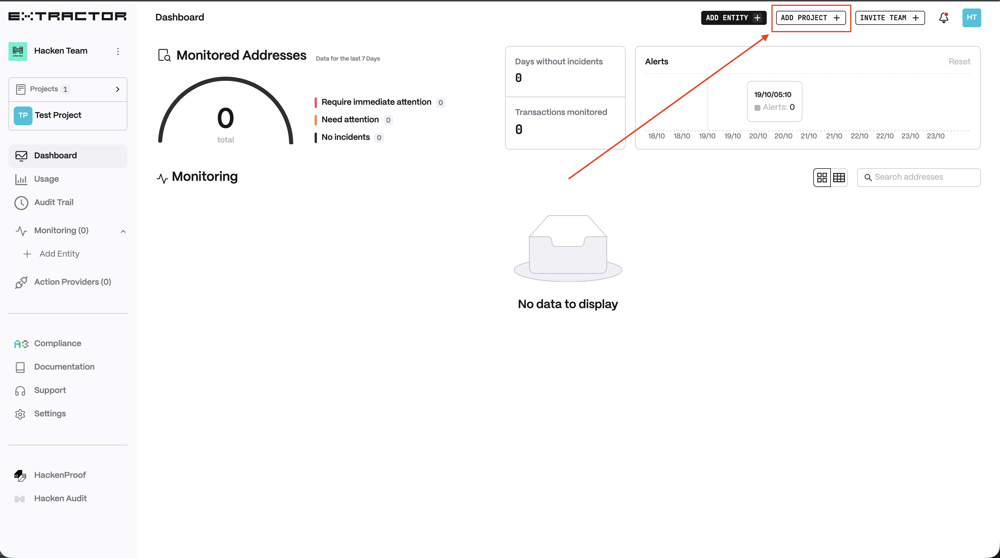
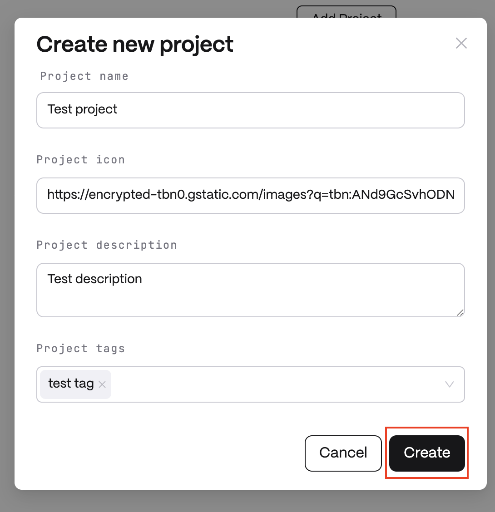
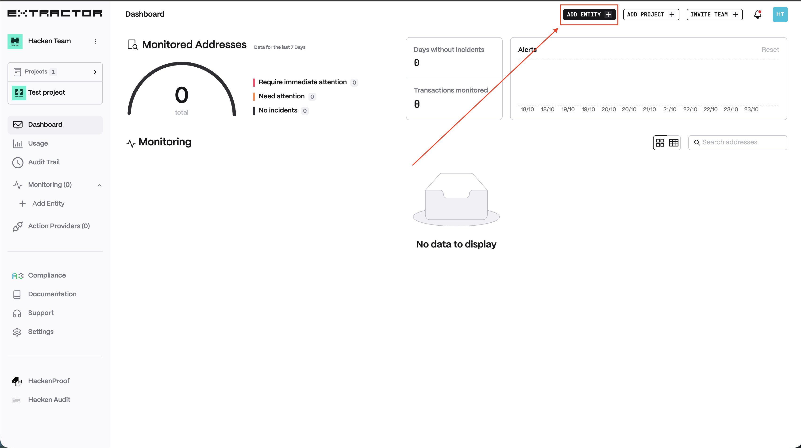
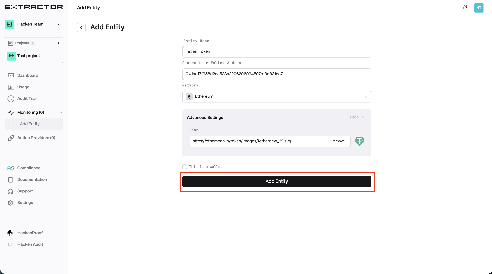
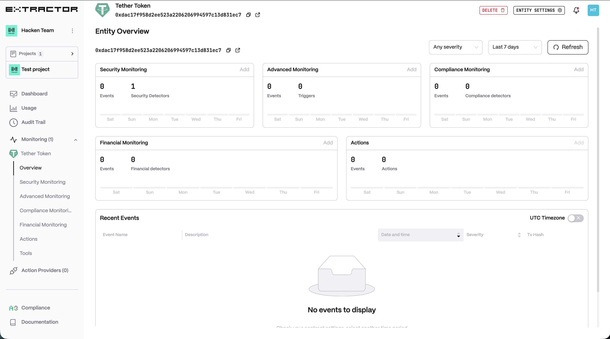

# 🚀 Getting Started

## About

Hacken Extractor is an advanced on-chain security monitoring system that provides real-time monitoring of your addresses and alerts you of any suspicious activity to prevent potential hacks. With Hacken Extractor, you can rest assured that your addresses are secure, and take immediate action if any security threats are detected.

## How does it work? 

Hacken Extractor continuously monitors your addresses and checks every transaction against it by the triggers and detectors.

The purpose of the attack detector is to recognize suspicious activity and collect suspicious accounts and contracts to warn against interactions with those addresses.\
\
A trigger is a specific condition or set of conditions that are monitored. When these conditions are met, the monitoring system will alert you in real time, providing complete monitoring and protection for your smart contracts. \
\
You have full control over the triggers and can customize them to meet your specific security needs, ensuring that the monitoring system only reacts to important events.

## Quick setup

1. Sign up/in to the app.
2. Create a project.
   1. Click on "Add project" button
      <figure><figcaption></figcaption></figure>
   2. Enter project name and click "Create"
      <figure><figcaption></figcaption></figure>

3. Add an address.  
   1. Click on "Add entity" button
      <figure><figcaption></figcaption></figure>
   2. Enter entity name, address, choose the network and click on "Add Entity"
      <figure><figcaption></figcaption></figure>
   3. Entity created
      <figure><figcaption></figcaption></figure>

