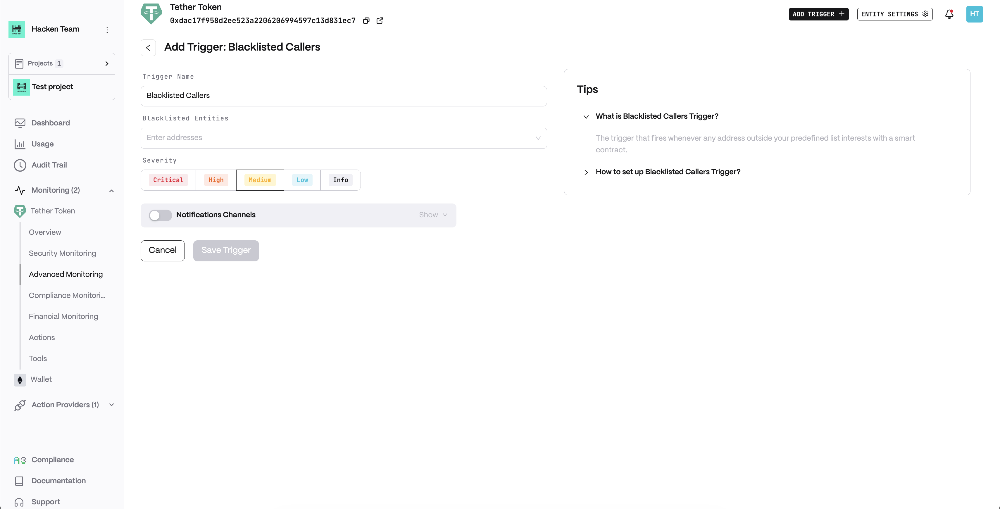
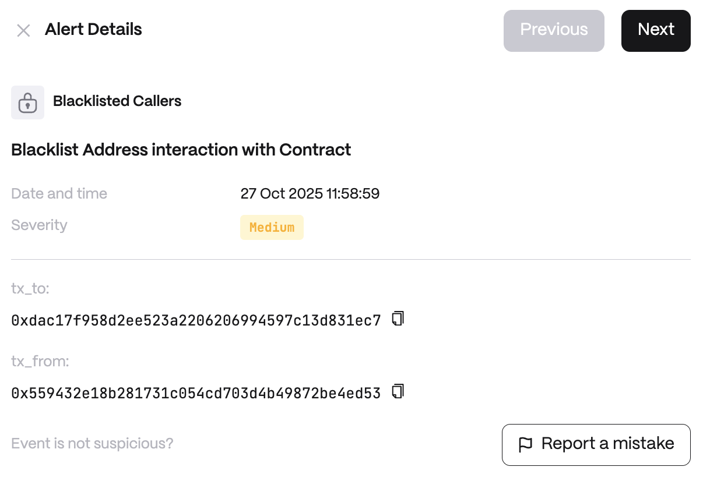

# Blacklisted Callers

**Detector Configuration**  
1. *Name* - Enter a descriptive name for your trigger, for example: "Blacklisted Callers".
2. *Blacklisted Entities* - A list of addresses.
<figure><figcaption></figcaption></figure>

**Alert example**
<figure><figcaption></figcaption></figure>