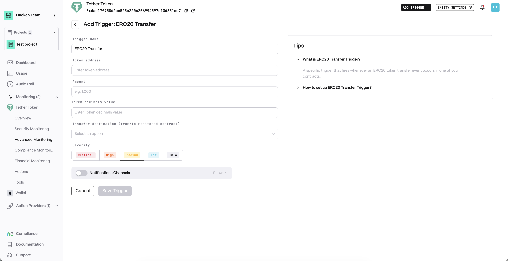
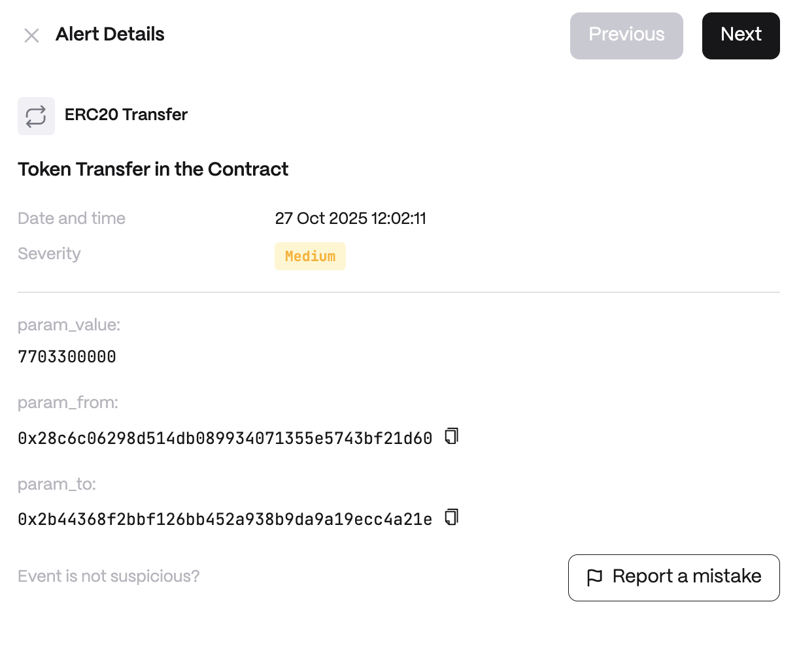

# ERC20 Transfer

**Detector Configuration**  
1. *Name* - Enter a descriptive name for your trigger, for example: "Blacklisted Callers".
2. *Token address* - An address of the token that must be monitored.
3. *Amount* - Token amount as a limit, transfer that exceeds the limit will be noticed.
4. *Token decimals value* - Specifies the smallest fraction of a token that can be handled.
5. *Transfer destination* - From, to or any of the contract.
<figure><figcaption></figcaption></figure>

**Alert example**
<figure><figcaption></figcaption></figure>