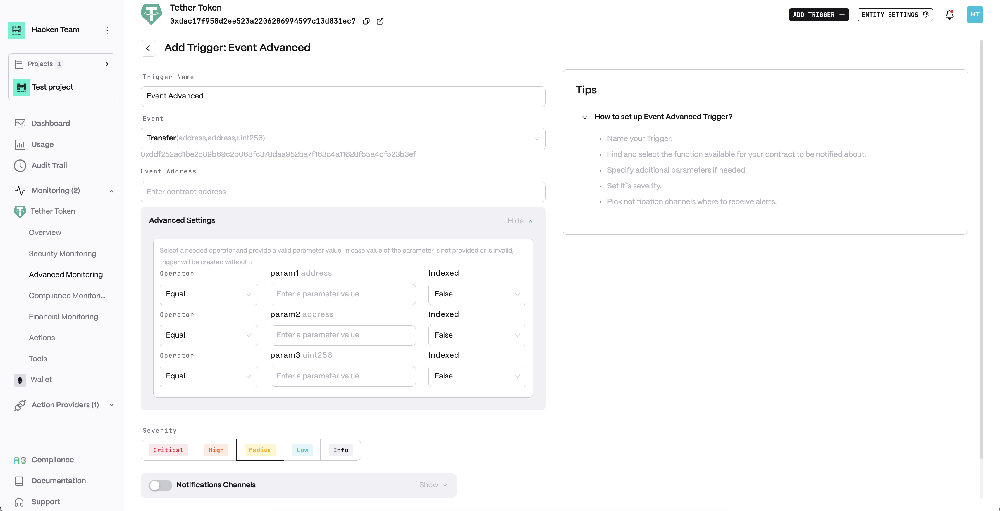
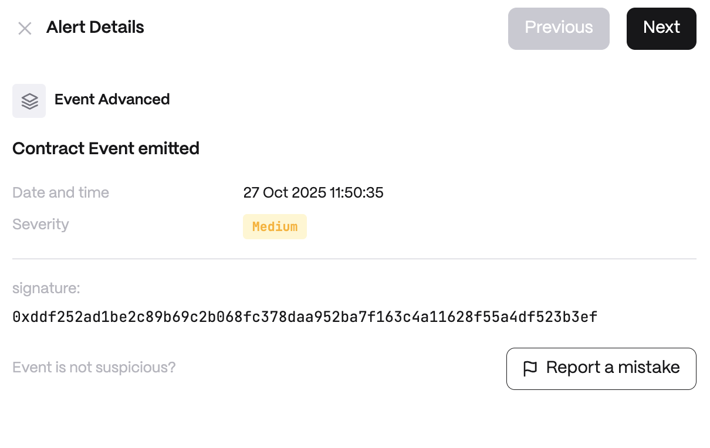

# Event Advanced

**Detector Configuration**  
1. *Name* - Enter a descriptive name for your trigger, for example: "Event Advanced".
2. *Event*
3. *Event Address*
<figure><figcaption></figcaption></figure>

**Alert example**
<figure><figcaption></figcaption></figure>