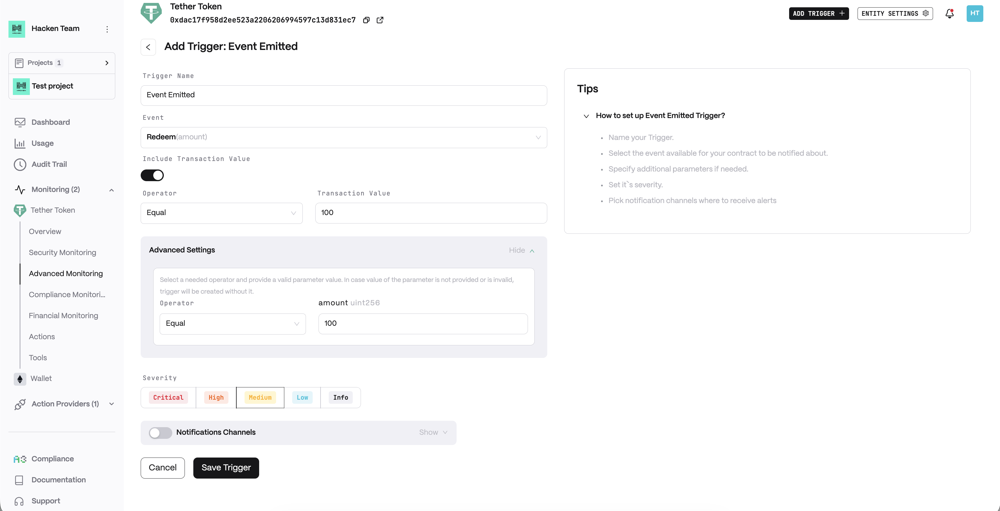
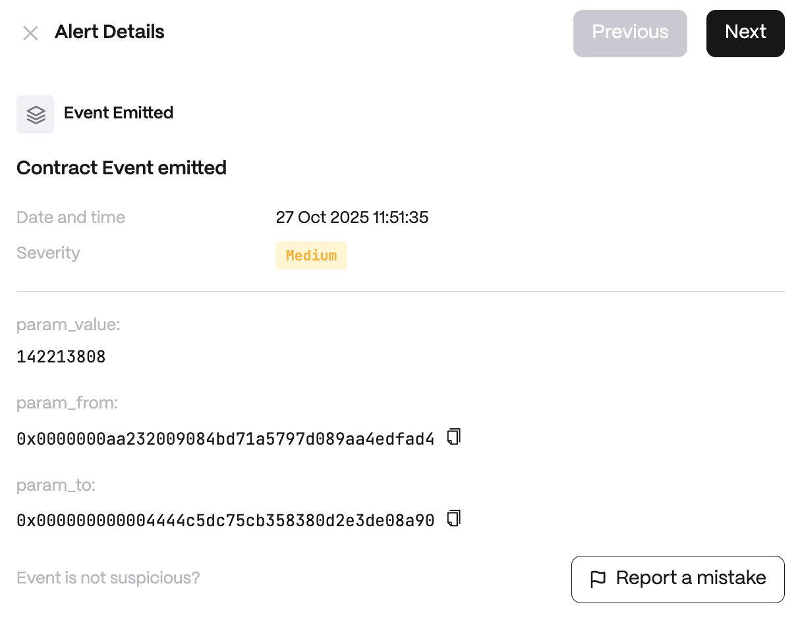

# Event Emitted

**Detector Configuration**  
1. *Name* - Enter a descriptive name for your trigger, for example: "Event Emitted".
2. *Event* - Execution of certain actions within the contract.
3. *Include Transaction Value*
    1. *Operator*
    2. *Transaction Value*
<figure><figcaption></figcaption></figure>

**Alert example**
<figure><figcaption></figcaption></figure>