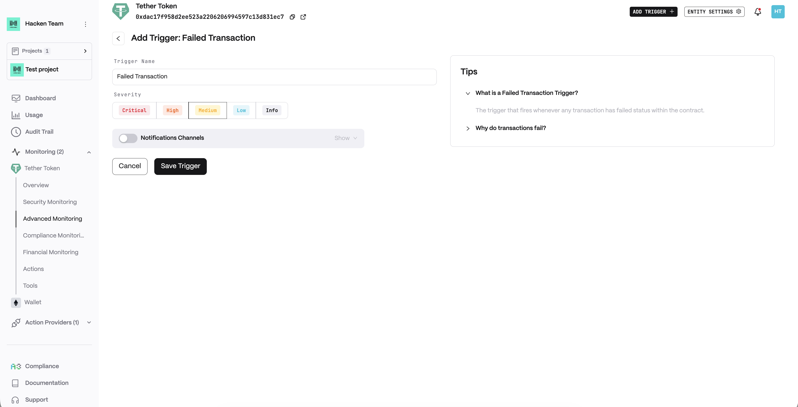
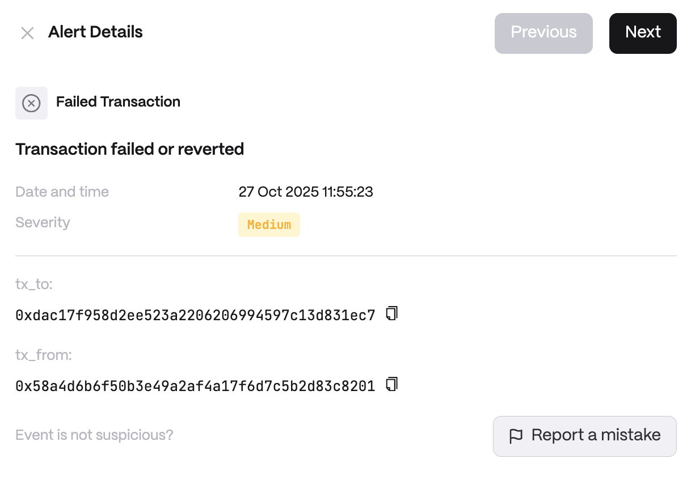

# Failed Transaction

**Detector Configuration**  
*Name* - Enter a descriptive name for your trigger, for example: "Failed Transaction".
<figure><figcaption></figcaption></figure>

**Alert example**
<figure><figcaption></figcaption></figure>