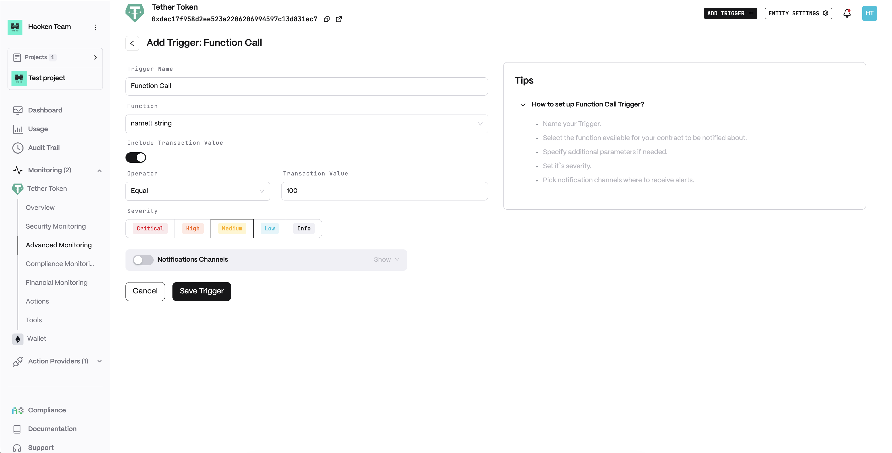
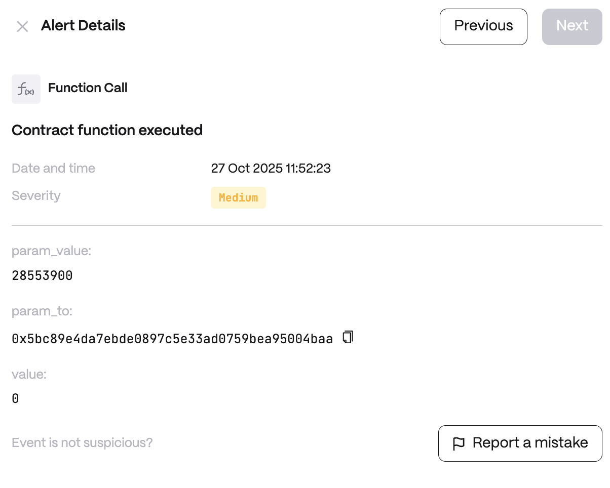

# Function Call

**Detector Configuration**  
1. *Name* - Enter a descriptive name for your trigger, for example: "Function Call".
2. *Function* - A method defined in the contract.
3. *Include Transaction Value*
    1. *Operator*
    2. *Transaction Value*
<figure><figcaption></figcaption></figure>

**Alert example**
<figure><figcaption></figcaption></figure>