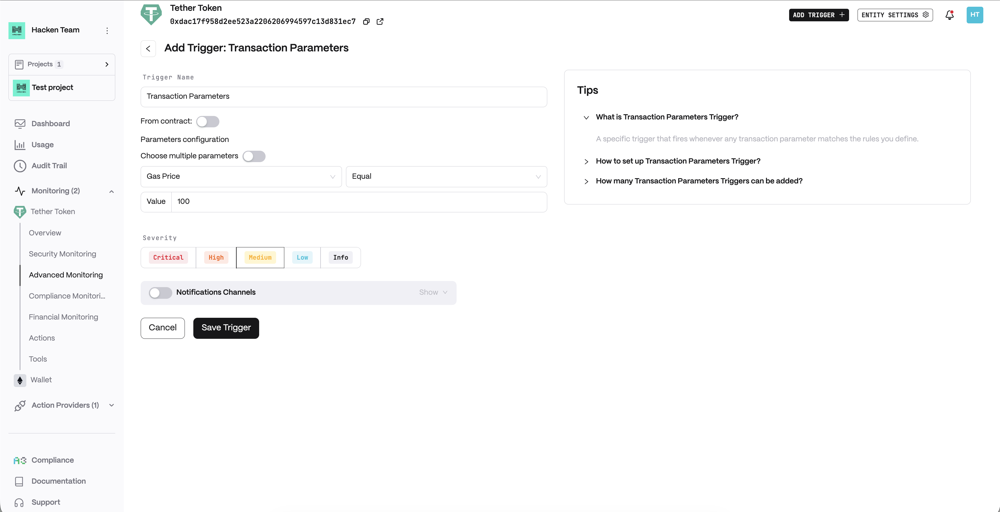
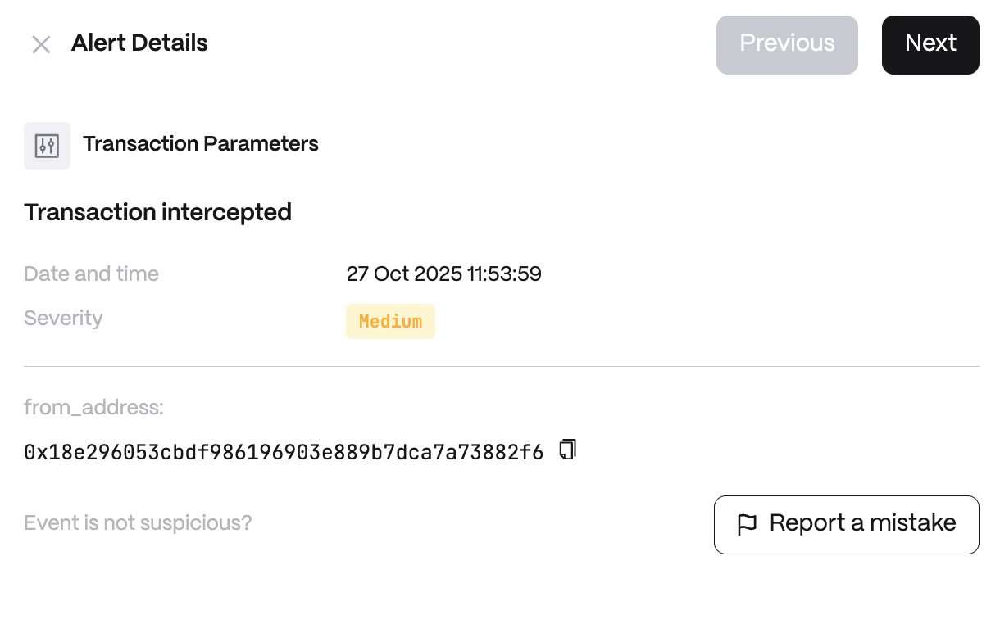

# Transaction Parameters

**Detector Configuration**  
1. *Name* - Enter a descriptive name for your trigger, for example: "Transaction Parameters".
2. *From contract*
3. *Parameters configuration*
    1. *Choose multiple parameters*
    2. *Parameter*
<figure><figcaption></figcaption></figure>

**Alert example**
<figure><figcaption></figcaption></figure>