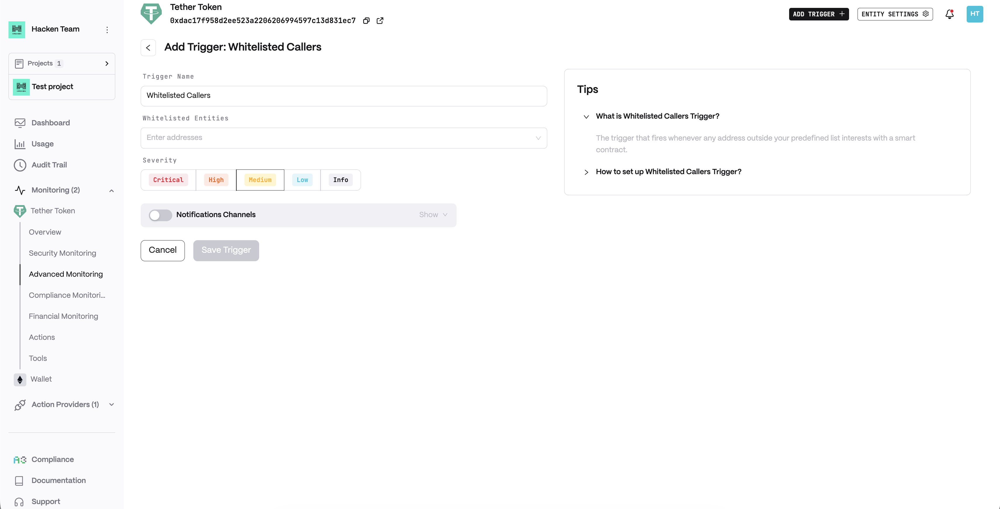
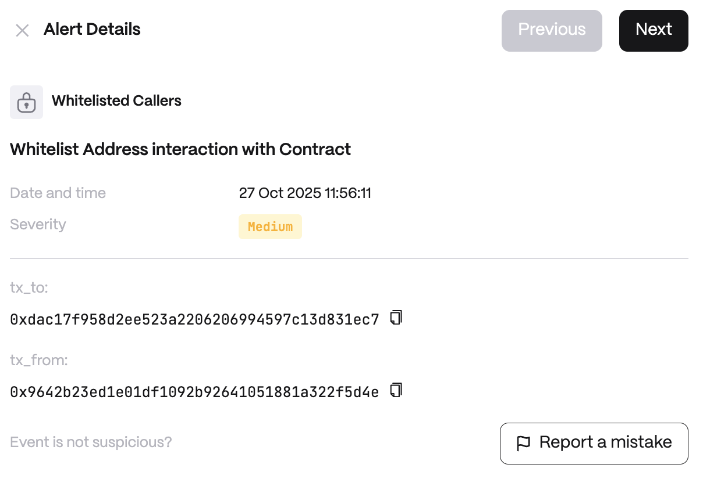

# Whitelisted Callers

**Detector Configuration**  
1. *Name* - Enter a descriptive name for your trigger, for example: "Whitelisted Callers".
2. *Whitelisted Entities* - A list of addresses.
<figure><figcaption></figcaption></figure>

**Alert example**
<figure><figcaption></figcaption></figure>