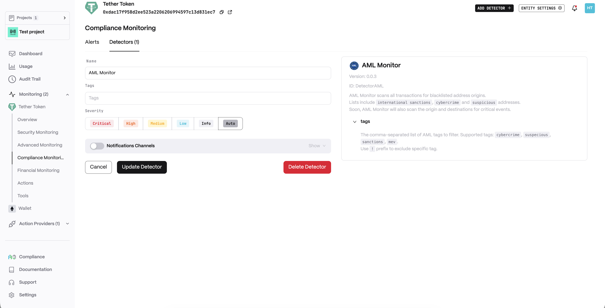
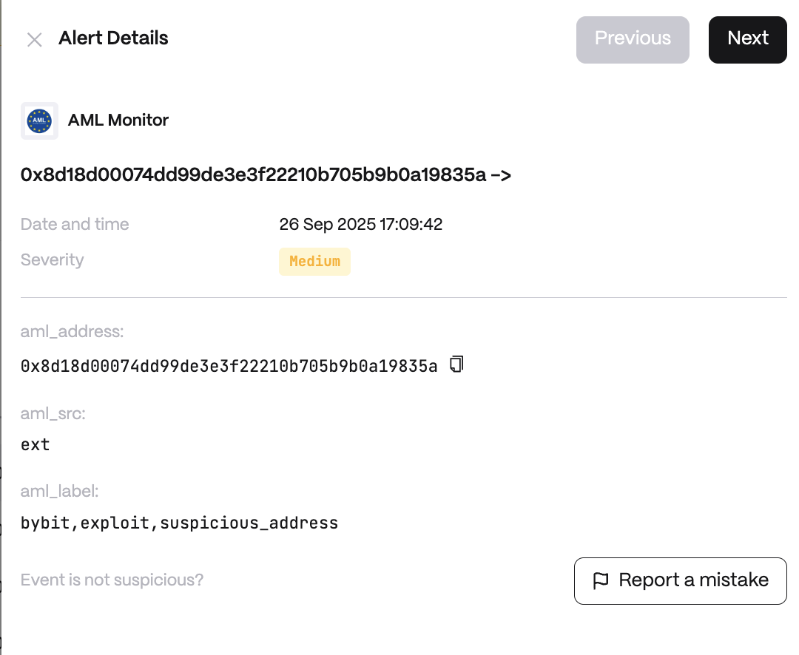

# AML Monitor

**Behavior**

### AML List

Extractor supports the following address lists:

* **Cybercrime**
* **Sanctions**
* **Suspicious**
* **Mev**

Soon, AML Monitor will also scan the origin and destinations for critical events.

**Use cases**

* Detect transactions linked to sanctioned or criminal wallets.
* Alert custodians on deposits from high-risk origins.
* Support AML/CFT compliance for institutional digital asset firms.


**Detector Configuration**  
1. *Name* - Enter a descriptive name for your monitor, for example: "AML Monitor".
2. *Tags* - The comma-separated list of AML tags to filter. Supported tags: ```cybercrime```, ```suspicious```, ```sanctions```, ```mev```. Use ```!``` prefix to exclude specific tag.
<figure><figcaption></figcaption></figure>

**Alert example**
<figure><figcaption></figcaption></figure>