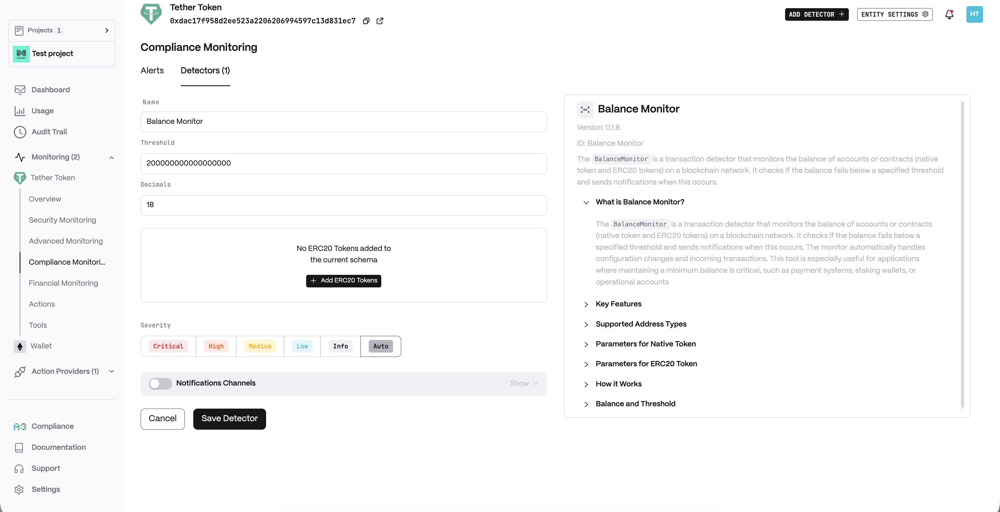
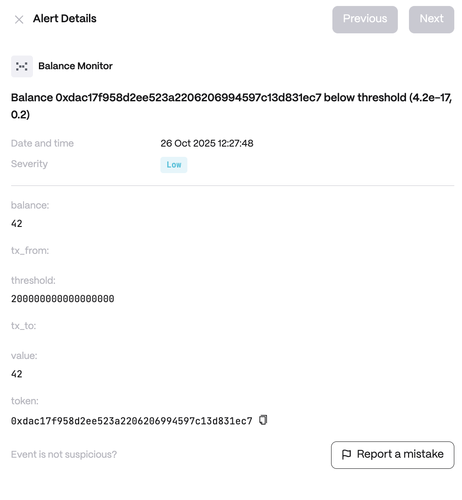

# Balance Monitor

**Behavior**  

* Tracks both native tokens and ERC20 tokens for monitored addresses
* Updates balances in real-time on relevant transactions and Transfer events
* Automatically adjusts to configuration changes without restarts
* Sends alerts when balance ≤ threshold with severity-based notifications

**Use cases**  

* DeFi Protocol Operations: Monitor liquidity pool addresses to ensure sufficient reserves for user withdrawals and prevent protocol insolvency
* Bridge Security: Track bridge contract balances across chains to detect potential drain attempts or insufficient liquidity for cross-chain transfers
* Treasury Management: Alert when DAO or project treasury balances drop below operational thresholds, preventing overspending or theft

**Detector Configuration**  
1. *Name* - Enter a descriptive name for your monitor, for example: "Balance Monitor".
2. *Threshold*
3. *Decimals*
4. *ERC20 Token*
<figure><figcaption></figcaption></figure>

**Alert example**
<figure><figcaption></figcaption></figure>