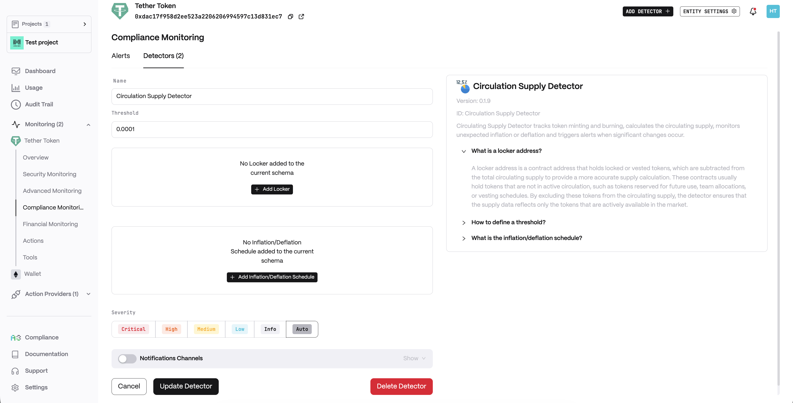
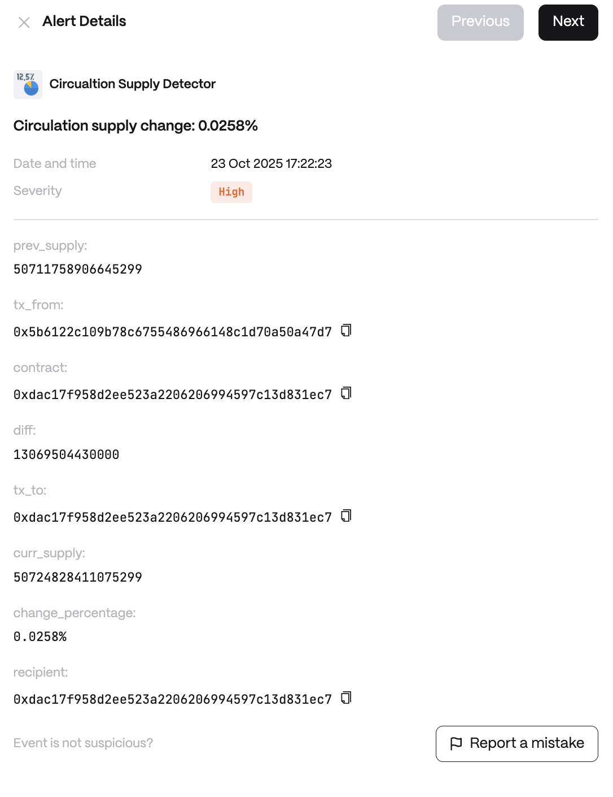

**Functionality:**

* Monitors News Feeds Posts
* Filters and scores posts on conditions
* Supports standard `rss`  and custom `reddit` / `twitter` Feed sources
* Generates Alerts for matched conditions&#x20;

**Use cases:**

* Posts and Updates from News feeds
* Token / Project / Blockchain specific news, announcements, incidents, sentiment

<figure><figcaption></figcaption></figure>

**Alert example**

<figure><figcaption></figcaption></figure>
