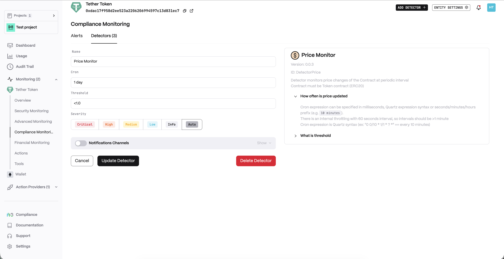
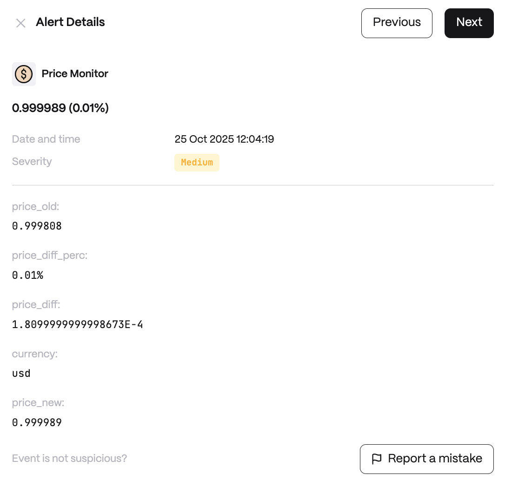

**Behavior**

When to query price:\
`cron` - On Cron interval\
`block` - On every new block

_Source_\
Where to query price:\
`oracle` - On-chain Feed (Chainlink Oracle format)\
`coingecko` - Coingecko Feed

_Currency_\
Currency of the price. Default is `usd`.

_NOTE_: Currently supported only for `coingecko` feed.\
`oracle` feed requires adding Chainlink Oracle Contracts in configuration

**Use cases**

* Alert on sudden price drops of stablecoins or RWAs.
* Detect oracle price manipulation attempts in DeFi protocols.
* Track token price feeds for liquidation risk management.

**Detector Configuration**

1. _Name_ - Enter a descriptive name for your monitor, for example: "Price Monitor".
2. _Cron_
3. _Threshold_

<figure><figcaption></figcaption></figure>

**Alert example**

<figure><figcaption></figcaption></figure>
