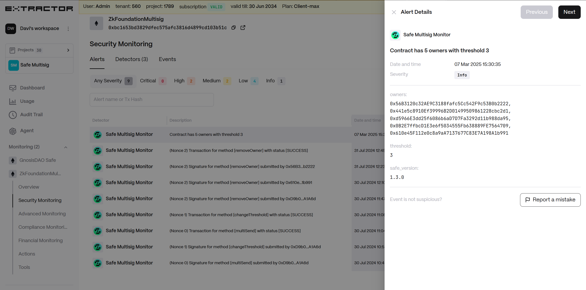

# Safe Multisig Monitor

## What is the Safe Multisig Monitor?

This is a monitoring service that tracks activities related to a Safe Multisig contract, including signer changes, transaction executions, and confirmation submissions.

## How does Safe approval process work?

The transaction approval process in a Safe Multisig contract involves the following steps:

1. **Proposal Submission**: Transactions are proposed by an owner of the multisig wallet.
2. **Signatures Collection**: Owners sign the proposed transaction. Each signature is added to the transaction data.
3. **Threshold Verification**: Once the required number of signatures (as per the configured threshold) is collected, the transaction becomes executable.
4. **Execution**: The transaction is executed on the blockchain. If it doesn't meet the signature threshold, it will remain pending.

## How does the monitor work?

The monitor continuously fetches data from the Safe Multisig contract and triggers events when:

* A new signer is detected.
* A transaction is executed after reaching the required threshold of confirmations.
* A signer submits a confirmation for a pending transaction.
* A submitted Safe transaction hash does not match the expected computed hash.
* A transaction signature does not match the expected signer.

## What types of events does this monitor trigger?

The monitor generates three types of events:

* Safe Multisig Signer - Triggered when the list of signers is retrieved.
* Safe Multisig Transaction - Triggered when a transaction is fully confirmed and executed.
* Safe Multisig Confirmation - Triggered when a signer submits a confirmation for a pending transaction.
* Safe Multisig Safe Tx Hash Mismatch - Triggered when a submitted Safe transaction hash does not match the expected computed hash.
* Safe Multisig Signature Mismatch - Triggered when a submitted signature does not match the expected signer.

## How does the Safe Multisig Monitor verify transaction security?

* It computes the Safe transaction hash and compares it to the submitted hash to ensure it has not been tampered with.
* It validates the signatures provided for each transaction to ensure authenticity.
* It logs detected mismatches and alerts users when discrepancies occur.

## Alerts

### Safe Multisig Owners

Triggered when the list of signers for a Safe Multisig contract is retrieved.

* This event is fetched when the monitor starts.
* Sends an event containing:
  * `monitored_contract`: The address of the Safe Multisig contract.
  * `owners`: The list of signer addresses of the Safe Multisig contract.
  * `threshold`: The threshold value required for transaction execution.
  * `safe_version`: The version of the Safe Multisig contract.
  * `desc`: "Contract has `<number_of_owners>` owner(s) with threshold `<threshold>`."

<figure><figcaption>
Safe Multisig: Owners
</figcaption></figure>

### Signature Confirmation Sent

Triggered when a new confirmation signature is submitted for a Safe transaction.

* This event is fetched every 5 minutes.
* Sends an event containing:
  * `monitored_contract`: The address of the Safe Multisig contract.
  * `signer`: The address of the signer who confirmed the transaction.
  * `tx_id`: The unique transaction ID from the Safe Multisig contract.
  * `safe_tx_hash`: The Safe-specific transaction hash.
  * `method_name`: The method being executed.
  * `data_decoded_json`: The decoded transaction data (JSON format).
  * `operation`: The operation type (Call (0), Delegate Call (1)).
  * `value`: The transaction value.
  * `nonce`: The nonce of the transaction in the Safe Multisig contract.
  * `buy_token_json`: (If applicable) The buy token address for swap transactions.
  * `sell_token_json`: (If applicable) The sell token address for swap transactions.
  * `sender`: (If applicable) The sender address for transfer transactions.
  * `recipient`: (If applicable) The recipient address for transfer transactions.
  * `tx_type`: The type of the transaction.
  * `transfer_info_decoded`: The decoded transfer information.
  * `tx_to`: The recipient address for non-transfer transactions.
  * `desc`: "(Nonce `<nonce>`) Signature for method \[`<method_name>`] submitted by `<truncated_signer_address>`."

<figure><figcaption>
Safe Multisig: Confirmation Signature
</figcaption></figure>

### Transaction Executed

Triggered when a Safe Multisig transaction has been fully confirmed and executed.

* This event is fetched every 5 minutes.
* Sends an event containing transaction details:
  * `monitored_contract`: The address of the Safe Multisig contract.
  * `tx_id`: The unique transaction ID from the Safe Multisig contract.
  * `tx_hash`: The Ethereum transaction hash.
  * `safe_tx_hash`: The Safe-specific transaction hash for execution.
  * `to`: The recipient address of the transaction.
  * `method`: The method name being executed in the transaction.
  * `data`: The decoded transaction data (JSON format).
  * `operation`: The operation type (Call (0), Delegate Call (1)).
  * `value`: The transaction value (amount transferred in the transaction).
  * `status`: The current status of the transaction (SUCCESS, FAILED, etc.).
  * `nonce`: The nonce of the transaction in the Safe Multisig contract.
  * `desc`: "(Nonce `<nonce>`) Transaction for method \[`<method>`] executed with status \[`<status>`]."

<figure><figcaption>
Safe Multisig: Transaction Executed
</figcaption></figure>

### Safe Transaction Hash Validation Failure

Triggered when the computed Safe transaction hash does not match the expected hash.

* Sends an event containing:
  * `monitored_contract`: The address of the Safe Multisig contract.
  * `signer`: The address of the signer who confirmed the transaction.
  * `tx_id`: The unique transaction ID from the Safe Multisig contract.
  * `safe_tx_hash`: The Safe-specific transaction hash.
  * `method_name`: The method being executed.
  * `data`: The decoded transaction data (JSON format).
  * `operation`: The operation type (Call (0), Delegate Call (1)).
  * `value`: The transaction value.
  * `nonce`: The nonce of the transaction in the Safe Multisig contract.
  * `desc`: "(Nonce `<nonce>`) Safe tx hash for method \[`<method_name>`] submitted by `<truncated_signer_address>` mismatched!"

#### Safe Transaction Hash Validation

* The monitor computes the expected `safeTxHash` using:
  * Contract address
  * Destination address (`to`)
  * Transaction value (`value`)
  * Transaction data (`data`)
  * Operation type (`operation`)
  * Gas parameters (`safeTxGas`, `baseGas`, `gasPrice`)
  * Gas token (`gasToken`)
  * Refund receiver (`refundReceiver`)
  * Nonce (`nonce`)
  * Safe version
* The computed hash is then compared against the received safeTxHash. If they do not match, an alert is triggered.

<figure><figcaption>
Safe Multisig: Safe Tx Hash Mismatched
</figcaption></figure>

### Signature Validation Failure

Triggered when a submitted signature does not match the expected signer.

* Sends an event containing:
  * `monitored_contract`: The address of the Safe Multisig contract.
  * `signer`: The address of the signer who confirmed the transaction.
  * `tx_id`: The unique transaction ID from the Safe Multisig contract.
  * `safe_tx_hash`: The Safe-specific transaction hash.
  * `method_name`: The method being executed.
  * `data_decoded_json`: The decoded transaction data (JSON format).
  * `operation`: The operation type (Call (0), Delegate Call (1)).
  * `value`: The transaction value.
  * `nonce`: The nonce of the transaction in the Safe Multisig contract.
  * `desc`: "(Nonce `<nonce>`) Signature for method \[`<method_name>`] submitted by `<truncated_signer_address>` mismatched!"

#### Signature Validation

* The monitor verifies the signature using the following process:
  * Extracts the r, s, and v values from the signature.
  * If v is 27 or 28, uses ECDSA signature verification to recover the signer's address.
  * If v is 31 or 32, adjusts v for Ethereum eth\_sign validation and recovers the signer's address using EIP-191 signed message verification.
  * The recovered address is compared with the expected signer's address.
  * The signature is also verified against the expected message, which is the `safeTxHash`.
  * If either the recovered address does not match the expected signer or the message does not match `safeTxHash`, an alert is triggered, indicating a potential forgery or incorrect signing.

<figure><figcaption>
Safe Multisig: Signature Mismatched
</figcaption></figure>

## Severity Levels and Triggers

* `Info (0.1)`: Default severity for general monitoring events such as Safe Multisig owner retrieval.
* `Low (0.15)`: Default severity for confirmation signature submissions.
* `Medium (0.25)`: Used when a transaction is successfully executed with no issues.
* `High (0.5)`: Triggered when the transaction contains an operation type other than `Call (0)` or has an unexpected execution status (`FAILED`, `CANCELLED`).
* `Critical (0.75)`: Triggered in the following cases:
  * The computed `safeTxHash` does not match the expected hash.
  * The submitted signature does not match the expected signer.

