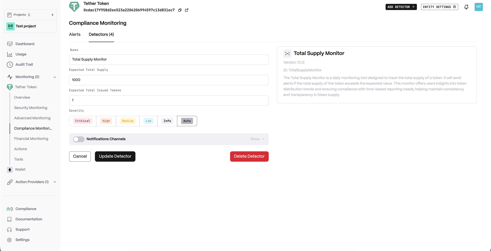
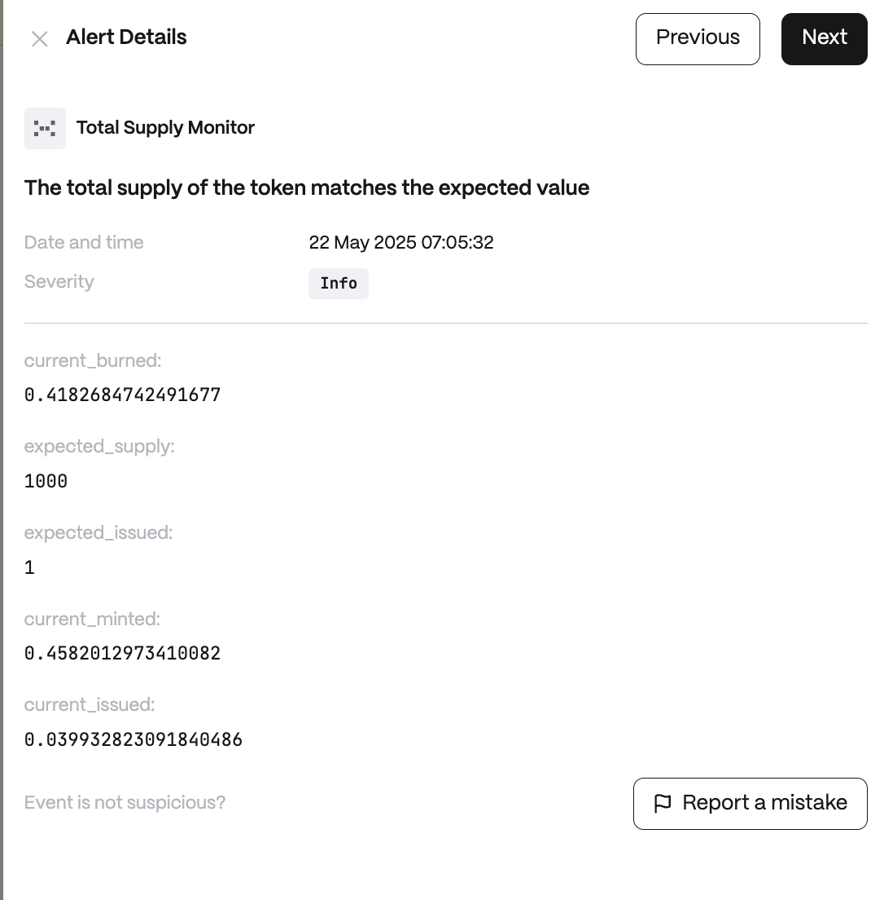

# Total Supply Monitor

**Behavior**  

* Executes scheduled blockchain queries for token supply data
* Compares current vs. expected supply with configurable thresholds
* Caches results to minimize API calls
* Emits alerts for supply mismatches

**Use cases**  

* Token Launch Verification: Ensure newly launched tokens maintain promised supply caps and prevent post-launch inflation
* Staking Protocol Monitoring: Verify that staking rewards don't exceed planned token emissions, maintaining protocol sustainability
* Regulatory Compliance: Monitor supply changes for tokens under regulatory scrutiny or reporting requirements

**Detector Configuration**  
1. *Name* - Enter a descriptive name for your monitor, for example: "Total Supply Monitor".
2. *Expected Total Supply*
3. *Expected Total Issued Tokens*
<figure><figcaption></figcaption></figure>

**Alert example**
<figure><figcaption></figcaption></figure>