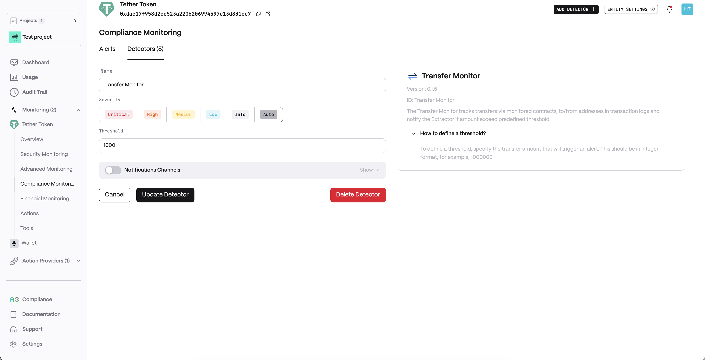
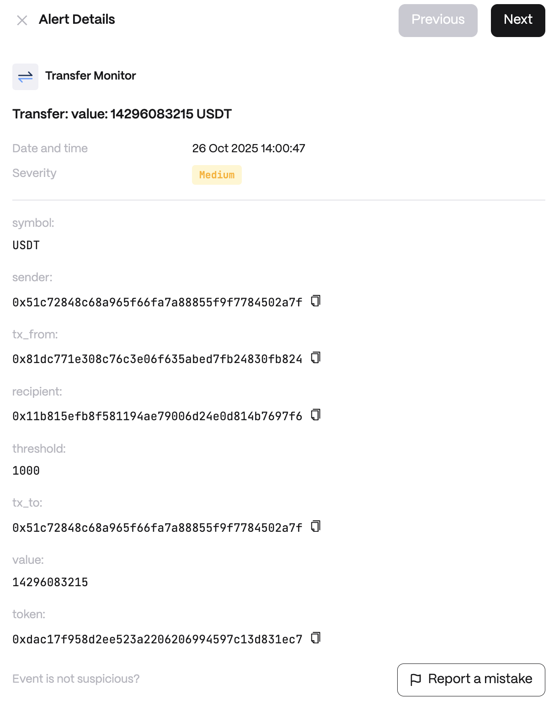

**Behavior**

* Monitors all ERC20 Transfer events
* Tracks transfers to/from monitored addresses
* Fetches token symbols for better readability
* Configurable thresholds per monitored address

**Use cases**

* Whale Tracking: Monitor large token movements by significant holders that could impact market prices
* Security Monitoring: Detect unusual transfer patterns that could indicate compromised accounts or malicious activity
* Compliance Reporting: Track significant transactions for regulatory reporting and audit purposes

**Detector Configuration**

1. _Name_ - Enter a descriptive name for your monitor, for example: "Transfer Monitor".
2. _Threshold_

<figure><figcaption></figcaption></figure>

**Alert example**

<figure><figcaption></figcaption></figure>
