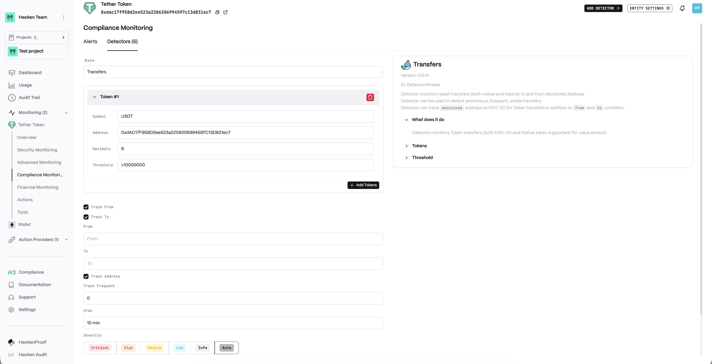
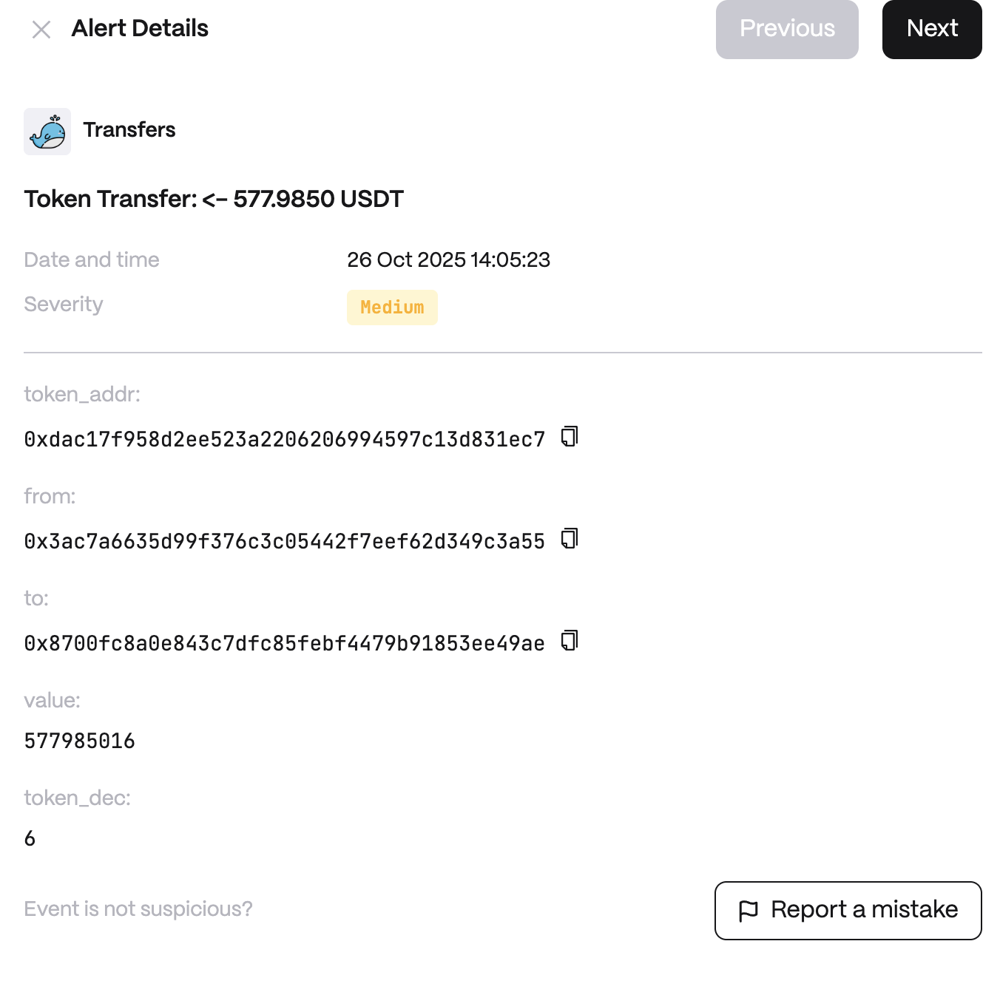

Anomalies examples:

* Large Transfers of ERC-20 or Native tokens
* Frequent Transfers

**Detector Configuration**

1. _Name_ - Enter a descriptive name for your monitor, for example: "Transfers".
2. _Token_
3. _Track From_
4. _Track To_
5. _From_
6. _To_
7. _Track Address_
8. _Track Frequent_
9. _Cron_

<figure><figcaption></figcaption></figure>

**Alert example**

<figure><figcaption></figcaption></figure>
