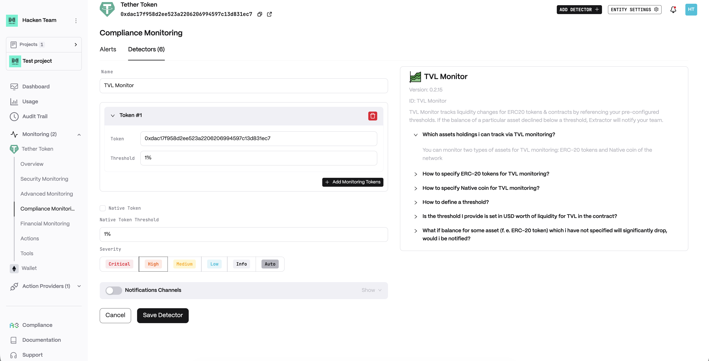
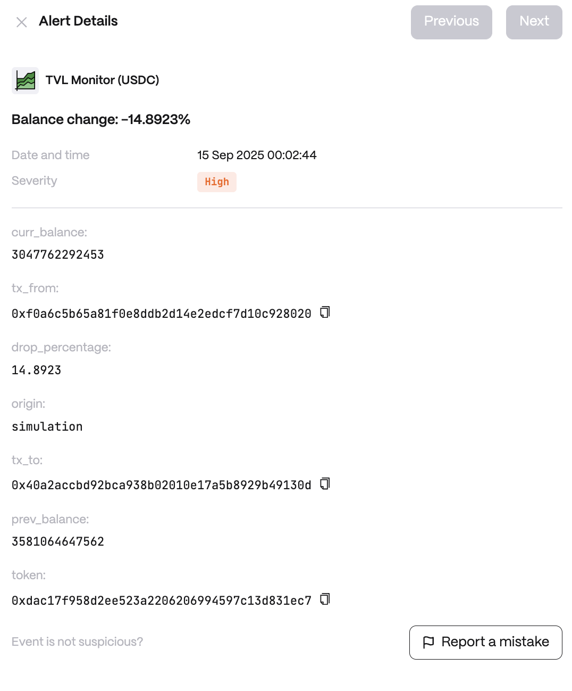

**Behavior**

* Tracks balance changes between blocks for monitored addresses
* Supports both percentage and absolute thresholds
* Monitors native tokens and ERC20 tokens separately
* Provides real-time alerts for significant TVL drops

**Use cases**

* DeFi Protocol Security: Detect potential exploits or large withdrawals that could indicate security issues or market manipulation
* Liquidity Pool Monitoring: Alert on significant liquidity removals that could impact trading and cause slippage
* Risk Management: Monitor institutional or whale movements that could signal market sentiment changes

**Detector Configuration**

1. _Name_ - Enter a descriptive name for your monitor, for example: "TVL Monitor".
2. _Token_
3. _Native Token_
4. \*Native Token Threshold

<figure><figcaption></figcaption></figure>

**Alert example**

<figure><figcaption></figcaption></figure>
