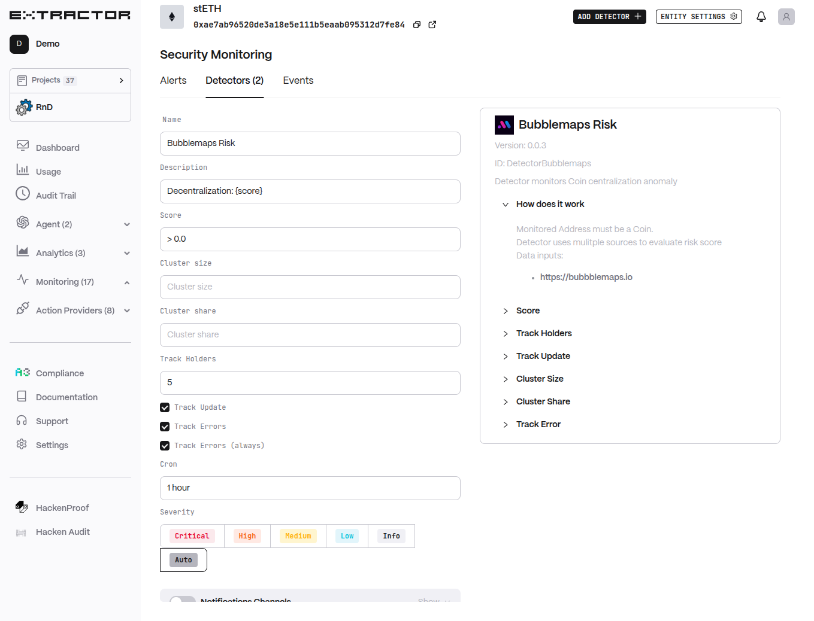

# Bubblemaps

Detector monitors Coin centralization anomaly 

## Functionality

- Monitored Address must be a Coin.
- Detector uses multiple sources to evaluate risk score.
- Data inputs: [https://bubblemaps.io](https://bubblemaps.io)
- Condition to filter Alerts score.
- Track Coin Top holders number.
- Track Score update time (can be calculated at different time).
- Cluster size changes condition (number).
- Cluster share changes condition (in `[0..1]` range).
- Track and alert on Errors.

## Configuraiton

 

NOTE: Screenshot should be max size 800px and clickable to expand to full size

- **Description** (`desc`, default: `Decentralization: {score}`): Description Template
- **Score** (`condition`, default: `> 0.0`): Score Condition expression
- **Cluster size** (`cluster_size`, default: ``): Cluster size condition
- **Cluster share** (`cluster_share`, default: ``): Cluster share condition
- **Track Holders** (`track_holders`, default: `5`): Track Top holders number
- **Track Update** (`track_update`, default: `True`): Track Score update
- **Track Errors** (`track_err`, default: `True`): Track Errors
- **Track Errors (always)** (`err_always`, default: `True`): Always alert on Errors
- **Cron** (`cron`, default: `1 hour`): Cron expression
- **Severity** (`severity`, default: `-1`): Severity

## Tags

- [Beta Features](/beta-features/detectors/README.md)
