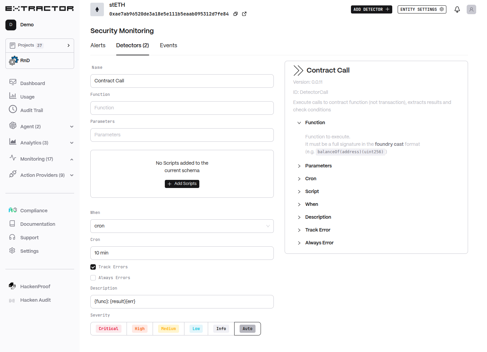

# Contract Call Monitor

Contract Call detector executes read-only calls to contract functions, extracts results, and evaluates conditions on a schedule or per block.

## Functionality

* Execute contract function calls (non-transactional) and extract results
* Run scripts to evaluate results and generate alerts
* Support cron or per-block execution modes

## Tags

* [Security Monitoring](../../security-monitoring/detectors/)
* [Compliance Monitoring](../../compliance-monitoring/detectors/)
* [Financial Monitoring](../../financial-monitoring/detectors/)

## Configuraiton

* Function: Function signature in foundry cast format (e.g., `balanceOf(address)(uint256)`).
* Parameters: Parameters passed to the function (space or newline separated). Tuples in `()`, arrays in `[]`, strings in `""`.
* Scripts: Scripts to execute on call result. Script type options: regexp, filter, sq, jq, js, ai, regexp\_score, sq\_score, jq\_score.
* When: Execution mode — `cron` or `block`.
* Cron: Interval to execute (e.g., `10 min`).
* Track Errors: Generate alerts on call/script errors.
* Always Errors: Alert on every error (otherwise suppress duplicate errors).
* Description: Alert description template using placeholders (e.g., `{func}: {result}{err}`).
* Severity: Alert severity level.
