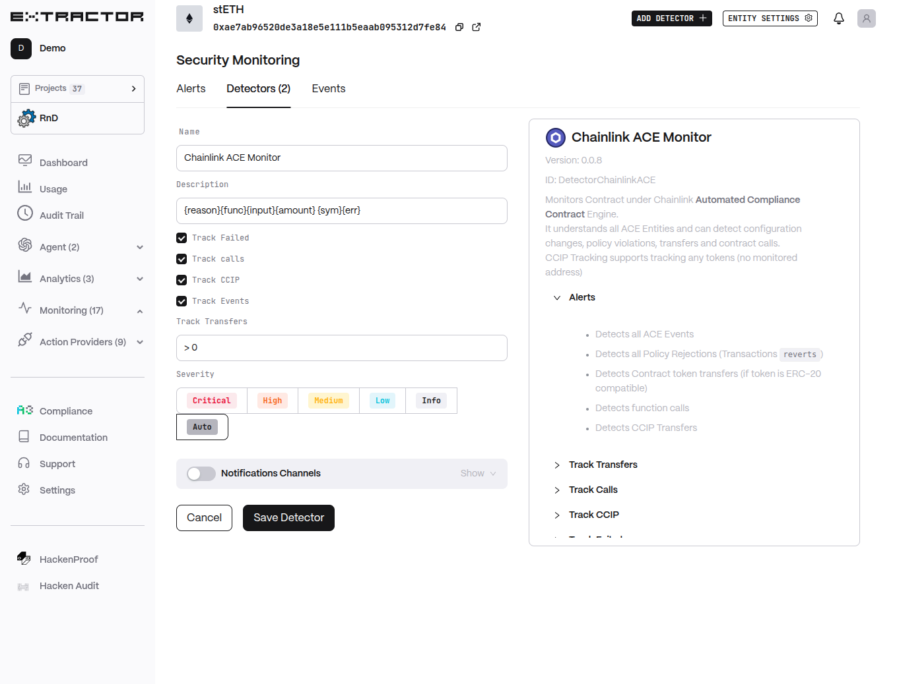

# Chainlink ACE Detector

Monitors contracts under the Chainlink Automated Compliance Contract Engine (ACE). Detects configuration changes, policy violations, transfers, contract calls, and CCIP transfers.

## Functionality

* Detects ACE events and policy rejections (transaction reverts).
* Tracks ERC-20 transfers, contract calls, and CCIP transfers.
* Supports detailed alert descriptions based on detected context.

## Configuration

* **Description** (`desc`): Alert description template (default `{reason}{func}{input}{amount} {sym}{err}`).
* **Track Failed** (`track_failed`): Track failed transactions / policy rejections.
* **Track calls** (`track_calls`): Track contract function calls.
* **Track CCIP** (`track_ccip`): Track CCIP transfers.
* **Track Events** (`track_events`): Track ACE events.
* **Track Transfers** (`track_transfers`): Condition for ERC-20 transfers (default `> 0`, token denomination).
* **Severity** (`severity`): Alert severity (default `Auto`).
