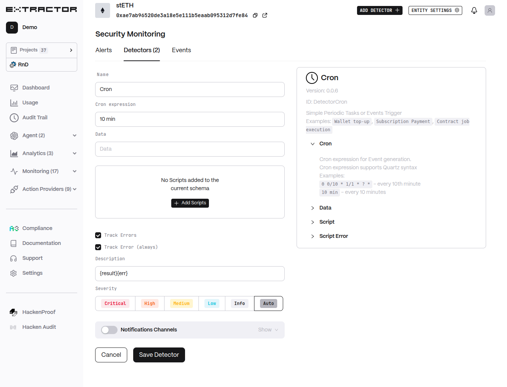

# Cron

Simple periodic tasks or event trigger. Examples include wallet top-up, subscription payment, and contract job execution.

## Functionality

* Generates events on a cron schedule (Quartz syntax supported).
* Passes arbitrary data into optional scripts for execution.
* Emits alerts based on script results or errors.

## Configuration

* **Cron expression** (`cron`): Schedule for event generation. Supports Quartz syntax (e.g., `0 0/10 * 1/1 * ? *` or `10 min`).
* **Data** (`data`): Arbitrary input passed to scripts.
* **Scripts** (`script`): List of scripts to execute. Each script supports:
  * **Type** (`type`): `regexp`, `filter`, `sq`, `jq`, `js`, `ai`, `regexp_score`, `sq_score`, `jq_score`.
  * **Source** (`src`): Script source code.
  * **Options** (`options`): Script options.
* **Track Errors** (`track_err`): Whether to create alerts when scripts error.
* **Track Error (always)** (`err_always`): Always alert on error.
* **Description** (`desc`): Alert description template (default `{result}{err}`).
* **Severity** (`severity`): Alert severity (default `Auto`).
