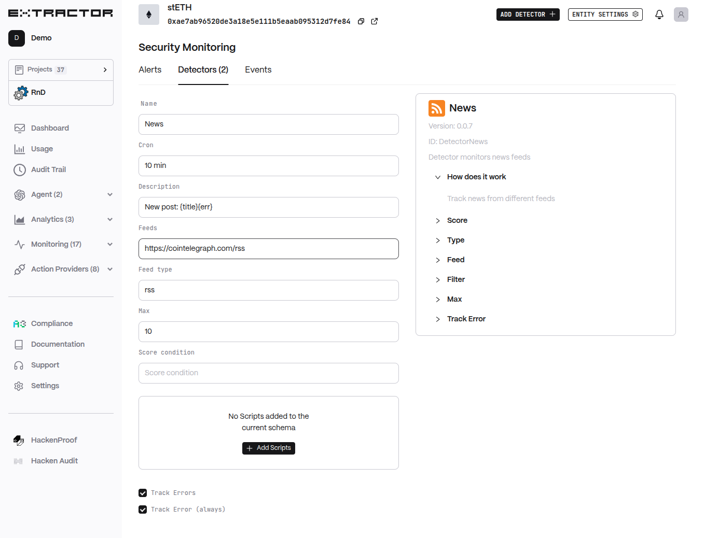

# News Detector

Detector monitors news feeds

## Functionality

* Track news from different feeds
* Condition to filter Alerts score.
* Type of news:
  * `rss`
  * `reddit`
* Feeds URI
* Mulitple URI's can be specified with comma separation. If `type` is not specified, feed can be prefixed with type (`rss://`. `reddit://`)
* Content Processor (currently `regexp` filter)
* Max number of entries per Feed
* Track Errors
* Muliple tags can be specified comma-separated (e.g. `sanctions, exploit`)
* Negative condition can be specified by prefixing tag with exclamation mark (e.g. `! sanctions`)

**Tags**

* `cybercrime` - OFAC or othe cybercrime activity
* `sanctions` - OFAC or other sanctioned entites
* `sanctions_exposure` - Indirect exposure to sanctioned entities
* `suspicious` - Suspcious activity
* `exploit` - Activity in Exploit case

## Configuraiton

NOTE: Screenshot should be max size 800px and clickable to expand to full size

* **Cron** (`cron`, default: `10 min`): Cron Interval
* **Description** (`desc`, default: `New post: {title}{err}`): Description Template
* **Feeds** (`feeds`, default: `https://cointelegraph.com/rss`): Feeds URI
* **Feed type** (`type`, default: `rss`): Feed Type
* **Max** (`max`, default: `10`): Max news
* **Score condition** (`score`, default: \`\`): Score
* **Scripts** (`script`, default: `[]`): Scripts to execute
* **Track Errors** (`track_err`, default: `True`): Track Errors as Alerts
* **Track Error (always)** (`err_always`, default: `True`): Always Alert on Error
* **Severity** (`severity`, default: `-1`): Severity

## Tags

* [Beta Features](../../beta-features/detectors/)
