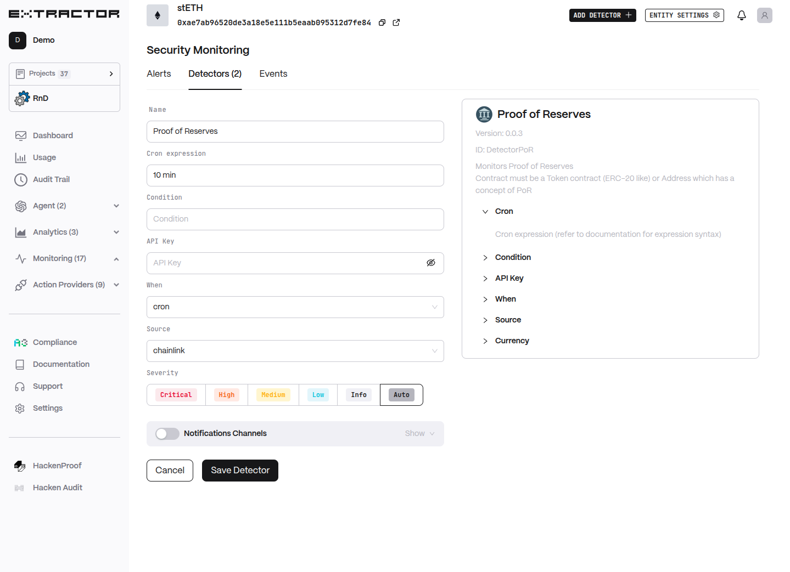

# Proof of Reserves Monitor

Monitors Proof of Reserves for configured contracts or addresses.

## Functionality

* Monitors PoR data for a token contract (ERC-20-like) or address that supports Proof of Reserves.
* Evaluates the provided threshold condition against the selected PoR data source.
* Runs on a schedule or on every new block, depending on configuration.
* Supports data feeds from Chainlink or Coingecko.

## Configuration

* **Cron expression**: Quartz-style cron interval (or milliseconds). Default is `10 min`.
* **Condition**: Threshold condition for PoR evaluation (see Condition syntax in docs).
* **API Key**: Custom API key to allow faster cron intervals (default minimum is 10 min).
* **When**: Execution mode — `cron` (on schedule) or `block` (every new block).
* **Source**: PoR data source — `chainlink` (on-chain Chainlink feed) or `coingecko` (Coingecko PoR feed).
* **Currency**: Price currency. Default is Asset; supported currencies depend on selected source.
* **Severity**: Alert severity level.
