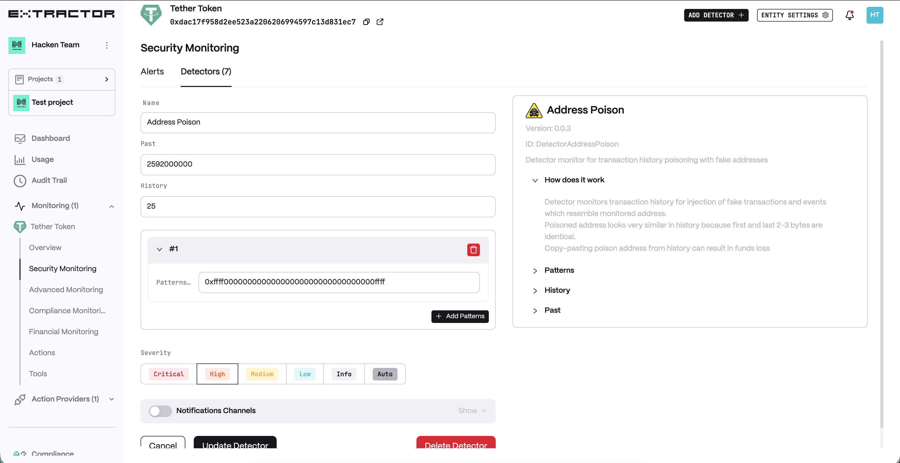
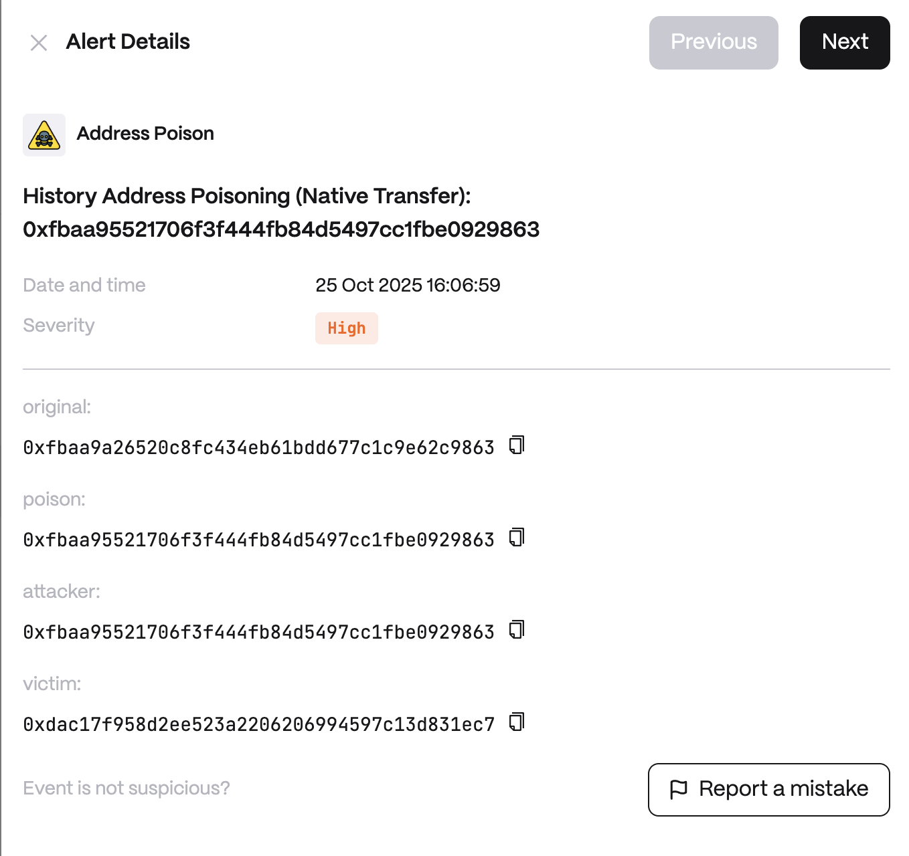

# Address Poison

**Behavior**

1. Constantly build and update “Whale” addresses dataset.
   1. Whale address is an address which holds tokens balances (+ native token balance) above configurable threshold (e.g. $100K)
   2. Only selected Tokens should be queried (like top 100 from Coingecko)
   3. Whale addresses can be stored in HaaS Labels DB with a tag e.g. “whale”
   4. Sentinel monitoring should cache whales dataset and periodically update it
   5. Balance calculations can be done in the following ways:
      1. Transaction monitoring: If address is present in transaction (to/from), call Node to get its native balance and all tokens. This can be expensive, but very real-time
      2. Transaction monitoring + Events monitoring. Native tokens balance is still detected by matching “to” and “from” and updating “value”. ERC20 tokens monitoring is done by monitoring Events (should check Events of ALL transactions since transfers can happen from contracts). This is much cheaper since no Node interaction is required and still real-time
      3. Periodic (\~1 hour) update of all addresses from Node balances
      4. Periodic (\~ several hours) update from indexing services like Dune
2. Scan for all Events in every transaction and try to match “similarity” (first and last 2-4 bytes match agains Whale addresses) in ERC20 tokens transfer events
3. Scan for all Transactions and try to match “to” field similarity (first and last 2-4 bytes match agains Whale addresses)
4. Alert with information about “Whale victim”, “Phishing Initiator” address and other metadata

**Use cases**

* Whale Protection Against Address Poisoning Attacks - The detector identifies when a whale address is being mimicked in history, preventing operators or end-users from mistakenly copying a poisoned address for withdrawals or transfers.
* Exchange & Custodian Compliance Monitoring - Centralized exchanges or custodians managing large user funds need to avoid sending assets to malicious look-alike addresses. The detector builds a real-time dataset of whale addresses and continuously cross-checks transactions/events for similarity-based poisoning attempts.
* Ecosystem-Wide Threat Intelligence & Labeling - Protocols, analytics platforms, or regulators want to map and share poisoned address attempts across chains. The detector stores whale addresses in HaaS Labels DB (tagged as “whale”) and enriches them with metadata on poisoned address attempts.

**Detector Configuration**

1. _Name_ - Enter a descriptive name for your monitor, for example: "Address Poison".
2. _Past_
3. _History_
4. _Patterns_

<figure><figcaption></figcaption></figure>

**Alert example**

<figure><figcaption></figcaption></figure>
