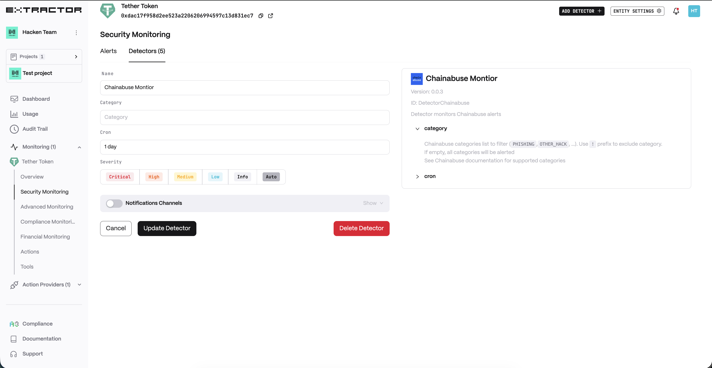

# Chainabuse Montior

**Behavior**  
Analyse and filter by LLM the malicious crypto activity to identify connection and pattern of latest reported threads with clients infrastructure as soon as possible to minimise harmful outcomes.  

**Supported Categories:**  
* PHISHING
* OTHER_BLACKMAIL
* SEXTORTION
* RANSOMWARE
* IMPERSONATION
* FAKE_RETURNS
* OTHER_HACK
* FAKE_PROJECT
* AIRDROP
* ROMANCE
* PIGBUTCHERING
* CONTRACT_EXPLOIT
* DONATION_SCAM
* SIM_SWAP
* OTHER_INVESTMENT_SCAM
* JOB_SCAM
* UPGRADE_SCAM
* MAN_IN_THE_MIDDLE_ATTACK
* OTHER

**Use cases**  
* Scam Alerts: get instant alerts when new scam reports (e.g. phishing or fake airdrops) appear on Chainabuse that target its brand or users. This allows security team to quickly warn customers and block any associated malicious addresses.

* Fraud Detection: scan incoming transactions against reported scam addresses. If a user’s wallet is involved with an address flagged for scams (like a romance or “pig butchering” scam), the system notifies the provider to investigate and potentially freeze the suspicious activity.

* Infrastructure Protection: A blockchain project team monitors Chainabuse reports for any mention of their smart contracts or tokens. For example, if a fake project or impersonation scam uses the project’s name, the Chainabuse Monitor will alert the team so they can address the issue.

**Detector Configuration**  
1. *Name* - Enter a descriptive name for your monitor, for example: "Chainabuse Monitor".
2. *Category(optional)* - If empty, all categories will be alerted.
3. *Cron* - Enter a cron expression to define the schedule.  
  Cron expression in Quartz syntax, milliseconds value or seconds/minutes/hours/days interval (e.g. ```24 hours```)
<figure><figcaption></figcaption></figure>

**Alert example**
<figure><figcaption></figcaption></figure>