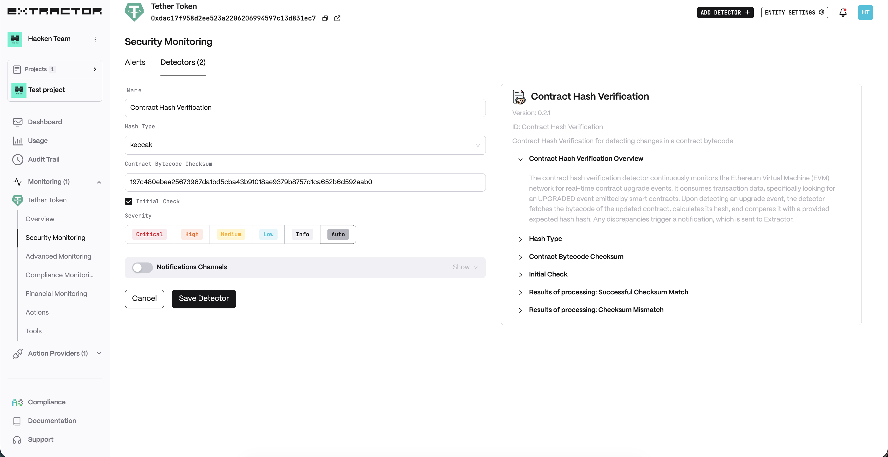
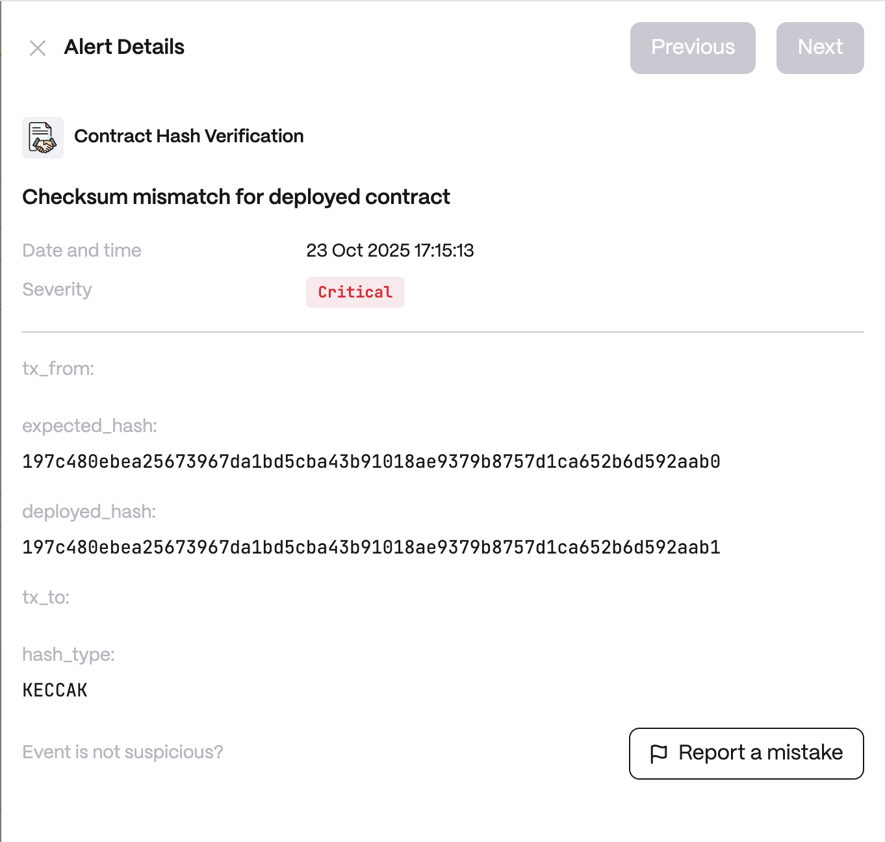

# Contract Hash Verification

**Behavior**  
* Listens for UPGRADED events from proxy contracts.
* Fetches implementation bytecode and computes hash.
* Compares against configured expected hashes.
* Supports initial checks and real-time monitoring.

**Use cases**  
* Proxy Security: Ensure only authorized contract upgrades are deployed, preventing malicious code injection in upgradeable contracts.

* Multi-sig Governance: Verify that DAO-approved contract upgrades match the intended implementation before execution.

* Audit Trail: Maintain cryptographic proof of contract versions for compliance and security audits.

**Detector Configuration**  
1. *Name* - Enter a descriptive name for your monitor, for example: "Contract Hash Verification".
2. *Hash Type* - Choose the hashing algorithm you want to use for verification:
    1. ```Keccak```
    2. ```SHA256```
3. *Contract Bytecode Checksum* - Enter the known, trusted hash value that the current bytecode should match.
4. *Initial Check* - Choose whether you want an immediate verification when the detector is created.
<figure><figcaption></figcaption></figure>

**Alert example**
<figure><figcaption></figcaption></figure>