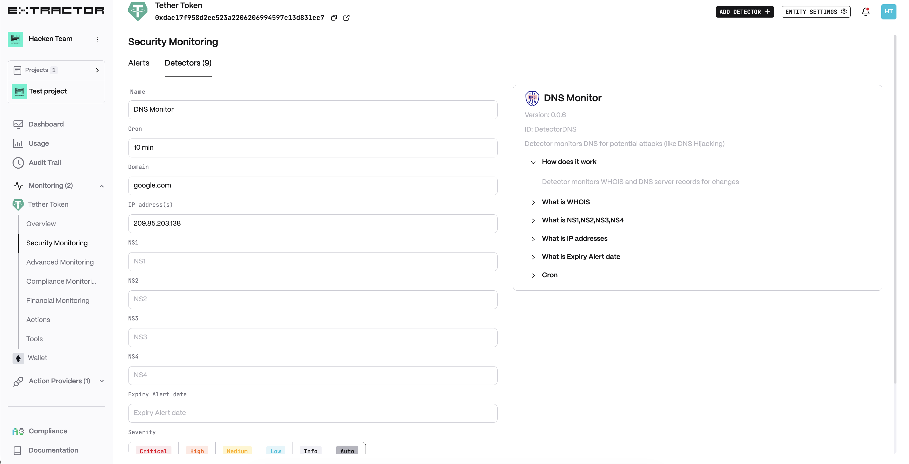
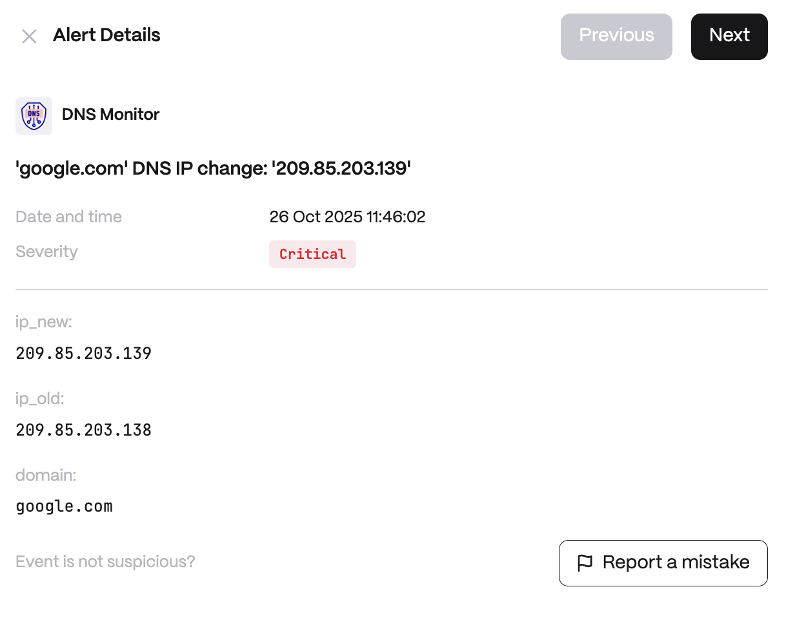

**Behavior**\
Monitors WHOIS and DNS server records Start alerting about Domain expiration before Domain expiration date.

**Use cases**

* Domain Hijacking & Phishing Prevention - An attacker compromises DNS records and redirects users to a malicious clone of a DeFi protocol or exchange website. The detector continuously monitors DNS and WHOIS records for unauthorized changes (e.g., altered A, CNAME, or NS records).
* Operational Continuity & Domain Expiration Alerts - A project’s critical domain (API endpoint, wallet interface, or dApp front-end) is at risk of expiring because renewal was overlooked. The detector issues early warnings well before the expiration date. What is monitored

**Detector Configuration**

1. _Name_ - Enter a descriptive name for your monitor, for example: "DNS Monitor".
2. _Cron_
3. _Domain_
4. _IP address(s)_
5. _NS1/2/3/4_
6. _Expiry Alert date_

<figure><figcaption></figcaption></figure>

**Alert example**

<figure><figcaption></figcaption></figure>
