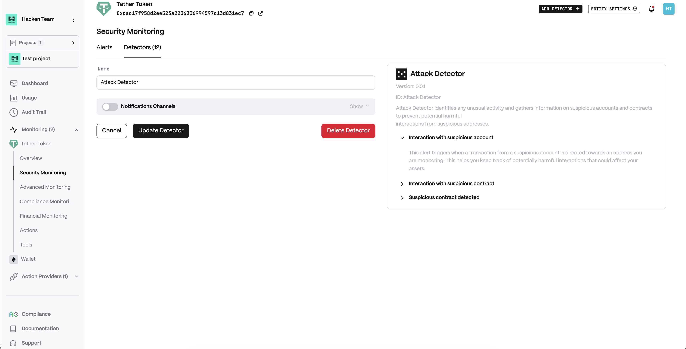

# Extractor Attack Detector

### Attack detector

Our detection system identifies any unusual activity and gathers information on suspicious accounts and contracts to prevent any potential interactions with these addresses. You may receive alerts regarding such activity:

**Interaction with suspicious account**

This alert triggers when a transaction from a suspicious account is directed towards an address you are monitoring. This helps you keep track of potentially harmful interactions that could affect your assets.

**Interaction with suspicious contract**

If a transaction to your monitored address includes internal calls from a suspicious contract, an alert is issued to inform you of these potentially hidden interactions.

**Suspicious contract detected**

When a new contract is created under dubious circumstances and involves addresses you monitor, you'll receive an alert. This ensures you're aware of new threats that may target your contracts directly.

**Detector Configuration**\
&#xNAN;_&#x4E;ame_ - Enter a descriptive name for your monitor, for example: "Attack Detector".

<figure><figcaption></figcaption></figure>

**Alert example**

<figure><figcaption></figcaption></figure>
