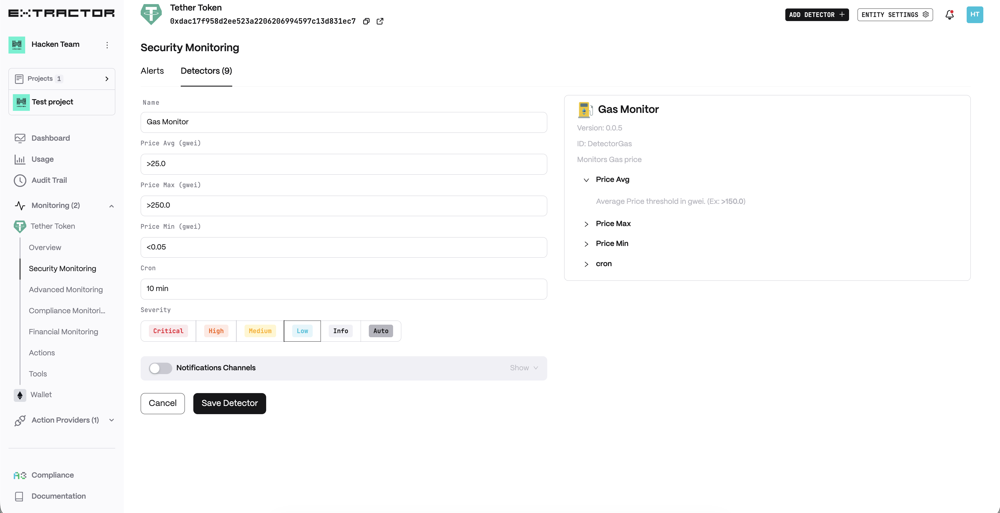
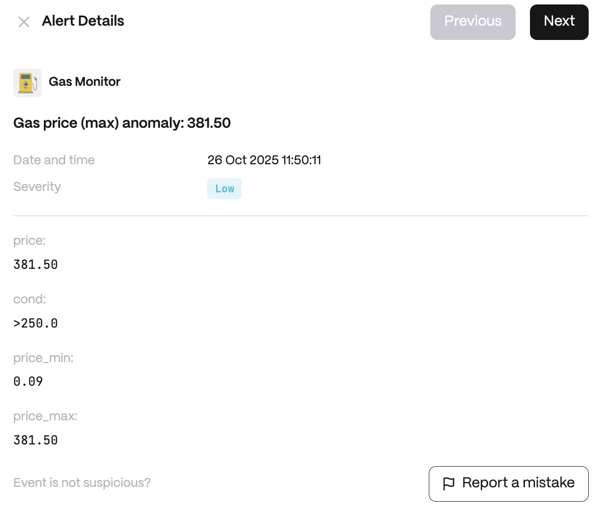

# Gas monitor

**Behavior**\
&#xNAN;_&#x50;rice Avg_ Average Price threshold in gwei. (Ex: >150.0)\
&#xNAN;_&#x50;rice Max_ Max Price threshold in gwei. (Ex: >250.0)\
&#xNAN;_&#x50;rice Min_ Min Price threshold in gwei. (Ex: <1.0)

**Use cases**

* Detect suspicious drops or high spike in gas usage that could indicate network attack.
* Trading Bot Fee Optimization: optimize transaction timing. The bot’s operators define a maximum gas price (say 150 gwei); if the current gas exceeds this, the Gas Monitor event tells the bot to hold off on executing trades.
* Network Congestion Safeguard: automatically safeguard users during extreme network congestion.

**Detector Configuration**

1. _Name_ - Enter a descriptive name for your monitor, for example: "Gas Monitor".
2. _Price Avg (gwei)_
3. _Price Max (gwei)_
4. _Price Min (gwei)_
5. _Cron_

<figure><figcaption></figcaption></figure>

**Alert example**

<figure><figcaption></figcaption></figure>
