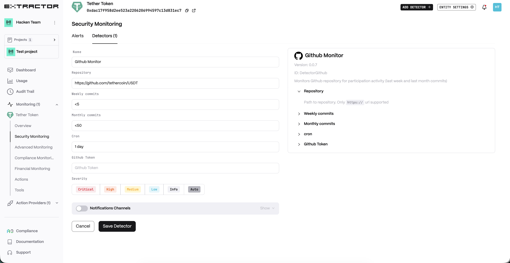
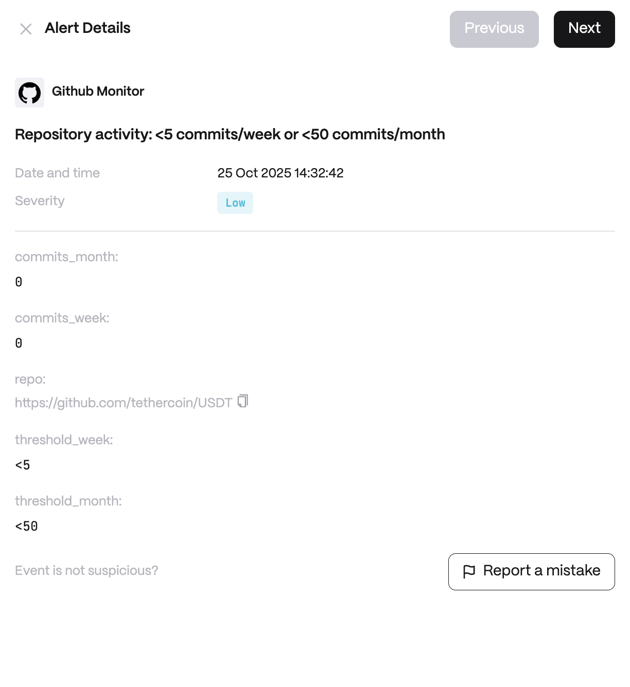

**Behavior**

* Repository Path to repository. Only https:// url supported
* Weekly Commits Weekly aggregated commit threshold
* Monthly Commits Monthly aggregated commit threshold

**Use cases**

* Monitor repo inactivity for early signs of abandoned projects.
* Detect sudden spikes in commits indicating emergency patches.
* Provide due diligence insights to investors on dev activity.

**Detector Configuration**

1. _Name_ - Enter a descriptive name for your monitor, for example: "Github Monitor".
2. _Repository_ - Enter the full URL of the GitHub repository you want to monitor.
3. _Weekly commits_ - Enter the number of commits you expect in a week.
4. _Monthly commits_ - Enter the number of commits you expect in a month.
5. _Cron_ - Enter a cron expression to define the schedule.\
   Cron expression in Quartz syntax, milliseconds value or seconds/minutes/hours/days interval (e.g. `24 hours`)
6. _Github Token_ - Enter `github_token` if repository is private.

<figure><figcaption></figcaption></figure>

**Alert example**

<figure><figcaption></figcaption></figure>
