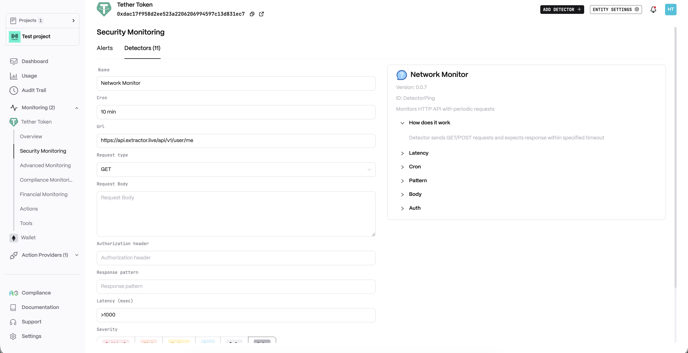
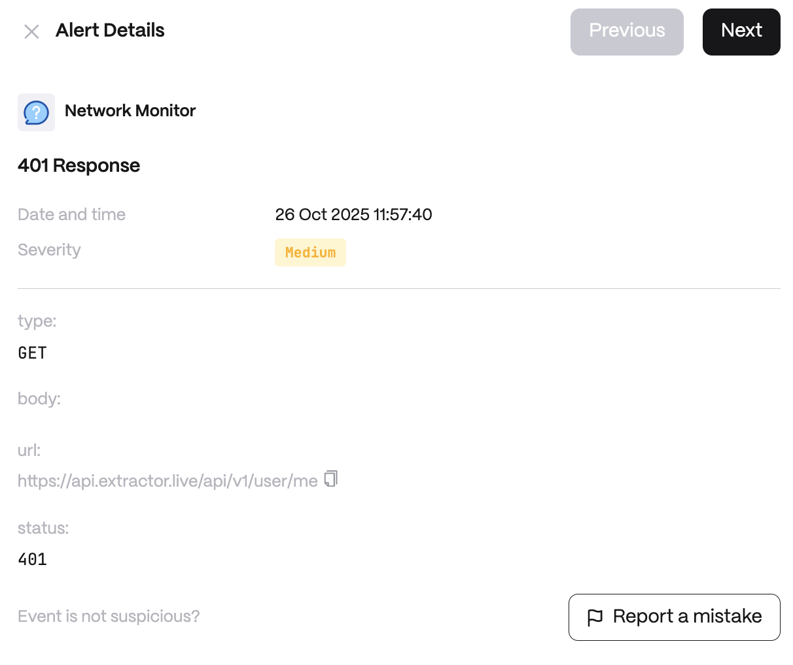

# Network Monitor

**Behavior**  
Detector sends GET/POST requests and expects response within specified timeout

**Use cases**  
* API Uptime Monitoring: A DeFi platform uses the Network Monitor to periodically send HTTP GET requests to its critical public API endpoint. If the API doesn’t respond within the specified timeout (indicating downtime or a crash), the monitor triggers an alert to the ops team. This helps the team react quickly to restore service and minimize disruption for users relying on that API.

* Third-Party Service Health Check: An exchange sets up the Network Monitor to watch a third-party price feed service via regular HTTP requests. If the price feed fails to respond or returns an error (for example, due to a provider outage), the monitor detects it and notifies the system to switch to a backup feed. The team is also alerted, so they can contact the provider or investigate issues before it affects trading operations.

**Detector Configuration**  
1. *Name* - Enter a descriptive name for your monitor, for example: "Network Monitor".
2. *Cron*
3. *Url*
4. *Request type*
5. *Request Body*
6. *Authorization header*
7. *Response pattern*
8. *Latency (msec)*
<figure><figcaption></figcaption></figure>

**Alert example**
<figure><figcaption></figcaption></figure>