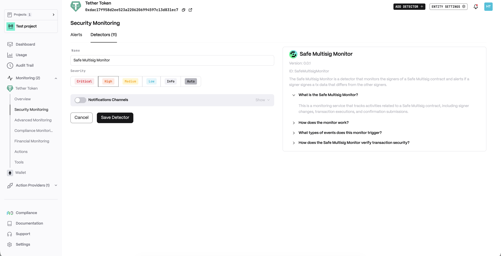
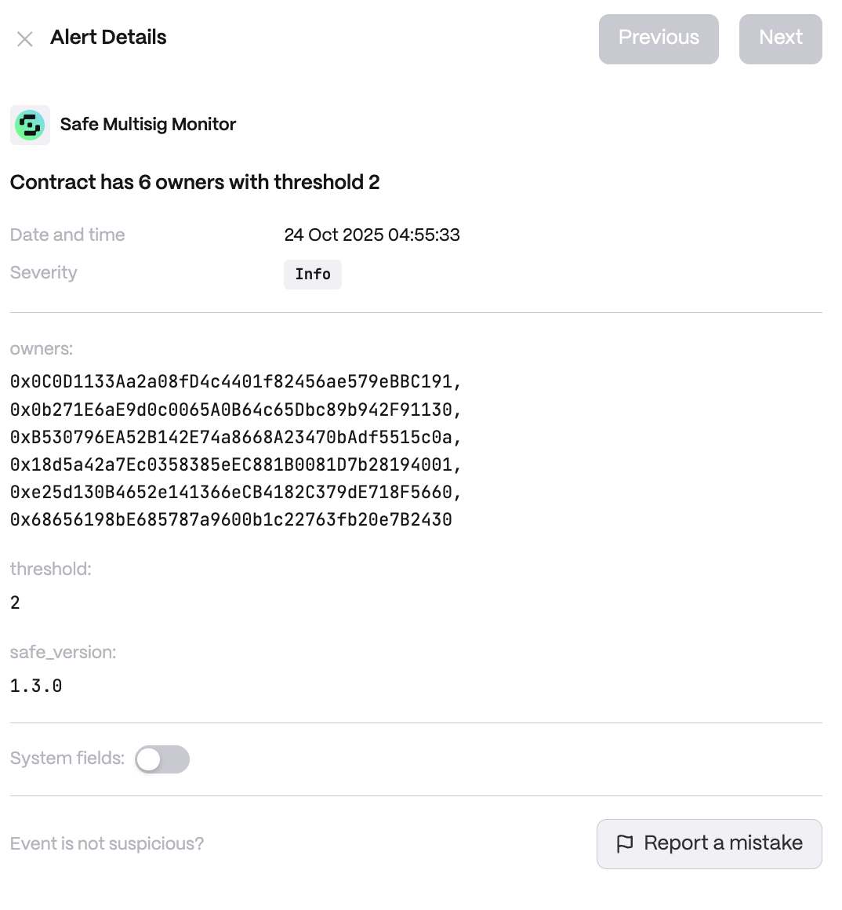

# Safe Multisig Monitor

**Behavior**  
*What is the Safe Multisig Monitor?*

This is a monitoring service that tracks activities related to a Safe Multisig contract, including signer changes, transaction executions, and confirmation submissions.

*How does the monitor work?*

The monitor continuously fetches data from the Safe Multisig contract and triggers events when:

* A new signer is detected.
* A transaction is executed after reaching the required threshold of confirmations.
* A signer submits a confirmation for a pending transaction.
* A submitted Safe transaction hash does not match the expected computed hash.
* A transaction signature does not match the expected signer.

*What types of events does this monitor trigger?*

The monitor generates three types of events:

* Safe Multisig Signer - Triggered when the list of signers is retrieved.
* Safe Multisig Transaction - Triggered when a transaction is fully confirmed and executed.
* Safe Multisig Confirmation - Triggered when a signer submits a confirmation for a pending transaction.
* Safe Multisig Safe Tx Hash Mismatch - Triggered when a submitted Safe transaction hash does not match the expected computed hash.
* Safe Multisig Signature Mismatch - Triggered when a submitted signature does not match the expected signer.
* Safe Multisig Simulation - Triggered when a new transaction is created on Safe.

*How does the Safe Multisig Monitor verify transaction security?*

* It computes the Safe transaction hash and compares it to the submitted hash to ensure it has not been tampered with.
* It validates the signatures provided for each transaction to ensure authenticity.
* It logs detected mismatches and alerts users when discrepancies occur.

**Use cases**  
* Unauthorized Signer Change Alert: A DAO that manages its treasury with a Gnosis Safe multisig enables the Safe Multisig Monitor to keep watch over the Safe’s signer list. If someone adds or removes a signer (which could happen maliciously if the Safe’s threshold is met by rogue actors, or via an unauthorized contract call), the monitor fires a Safe Multisig Signer event. The DAO’s members are alerted immediately, allowing them to investigate and, if necessary, use emergency recovery options to revert any unauthorized governance changes before funds can be moved.

* Transaction Hash Verification: The Safe Multisig Monitor ensures that the transaction data confirmed by all signers is consistent. For example, imagine a scenario where one signer’s interface is compromised and shows them a benign transaction, while the actual data being submitted to the Safe is different (malicious). The monitor computes the expected Safe transaction hash and compares it to the submitted hash. If they don’t match, a Safe Tx Hash Mismatch alert is generated. This warns the team that a potentially tampered or unintended transaction was caught, preventing it from being executed even if signers were tricked into confirming.

* Signature Authenticity Check: When a Safe transaction is fully signed and ready to execute, the Safe Multisig Monitor validates each signature against the known signer addresses. If a signature doesn’t match the expected signer (for instance, if someone somehow forged a signature or a signer’s key was compromised), the monitor raises a Safe Multisig Signature Mismatch event. In practice, suppose a hacker tried to use a stolen private key to sign a transaction – the monitor would detect that the signature isn’t from a legitimate current signer and alert the team, who can then halt the transaction and investigate the breach.

**Detector Configuration**  
*Name* - Enter a descriptive name for your monitor, for example: "Safe Multisig Monitor".
<figure><figcaption></figcaption></figure>

**Alert example**
<figure><figcaption></figcaption></figure>