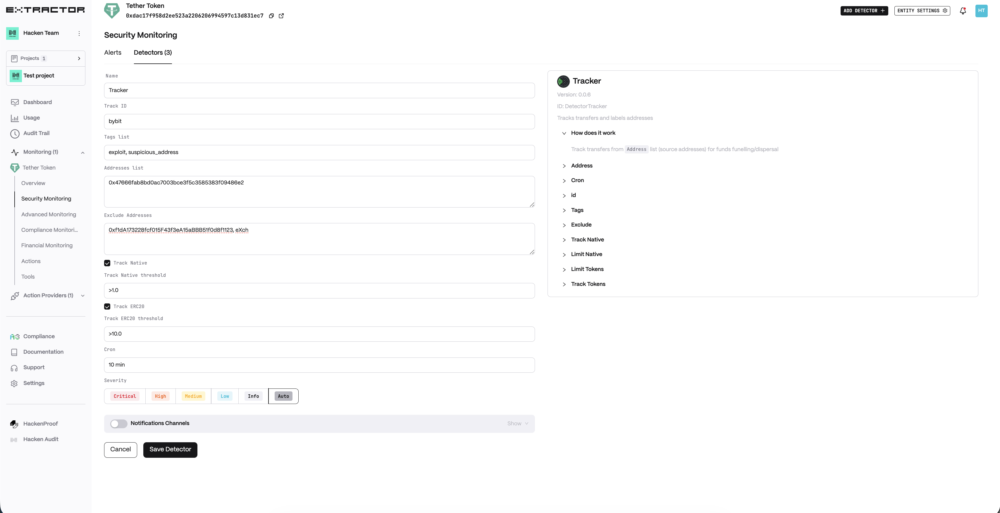
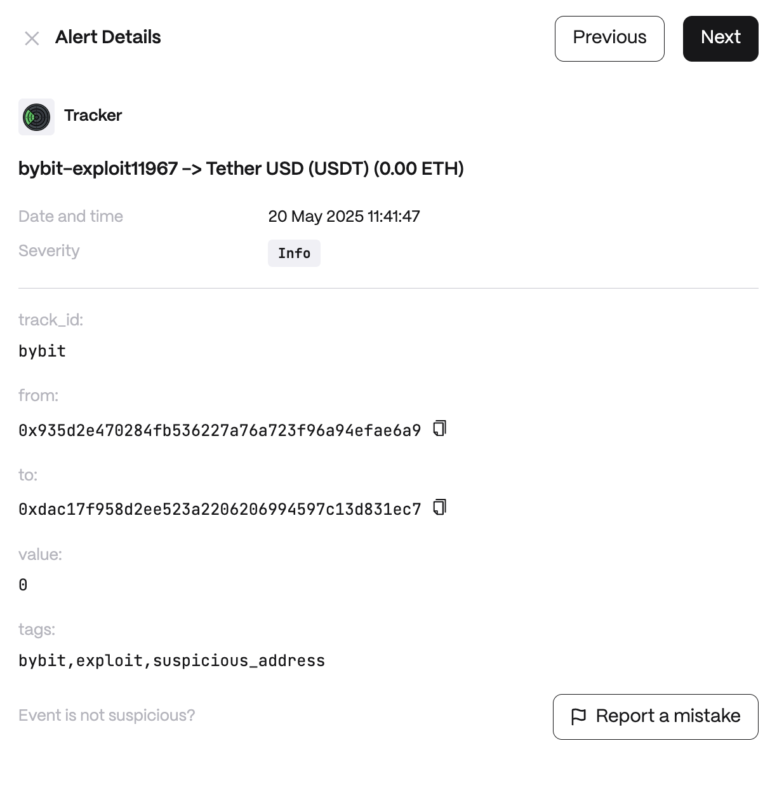

# Tracker

**Behavior**  
Track transfers from monitored Address list for assets movements (funelling/dispersal)

*Address*  
List of additional addresses to track (comma separated). Monitored Address is always added by default

*ID*  
Track Identifier to group label address (e.g. bybit). Mandatory and must be unqiue for every tracker

*Tags*  
Comma-separated list of tags to add to each detected address

*Exclude*  
Exclude addresses (with optional labels).  
Format example:
```0xf1dA173228fcf015F43f3eA15aBBB51f0d8f1123, eXch```   

*ATTENTION*: Each address should be on a new line (csv format)

Track Native (e.g. ETH) transfer

**Use cases**  
* Stolen Funds Tracing: After a security breach in which cryptocurrency is stolen follow the money trail. Input the hacker’s known wallet address into the Tracker and assign it a label. From then on, every time the hacker tries to move funds to new addresses, the monitor catches those transfers. Each new recipient address is automatically labeled, allowing investigators to map out all associated addresses and coordinate with law enforcement or other exchanges to freeze funds at each hop.

* High-Risk Address Monitoring: maintain a list of addresses suspected in money laundering or fraud schemes. Whenever those addresses send funds to any other address, the new addresses are flagged and tagged. This continuously expanding watchlist helps the compliance team identify the network of illicit actors and ensures any interaction with their platform by these addresses can be swiftly flagged or blocked.

* Token Distribution Oversight: monitor the flow of tokens from known sources. As tokens move from addresses into the market, the detector labels the new holder addresses with tags indicating origin (e.g., “Investor Token Release – Q1”). This provides the team with real-time insight into where tokens are spreading. 

**Detector Configuration**  
1. *Name* - Enter a descriptive name for your monitor, for example: "Tracker".
2. *Track ID* - Enter Track Identifier to group label address (e.g. ```bybit```).
3. *Tags list* - Enter comma separated list of tags to add to each detected address.
4. *Addresses list* - List of original addresses to track (comma separated).
5. *Track Native* - Choose whether you want an Track Native (ETH) transfer.
6. *Track Native threshold*
7. *Track ERC20* - Choose whether you want an Track Native ERC-20 transfer.
8. *Track ERC20 threshold*
9. *Cron* - Enter a cron expression to define the schedule.  
  Cron expression in Quartz syntax, milliseconds value or seconds/minutes/hours/days interval (e.g. ```24 hours```)
<figure><figcaption></figcaption></figure>

**Alert example**
<figure><figcaption></figcaption></figure>