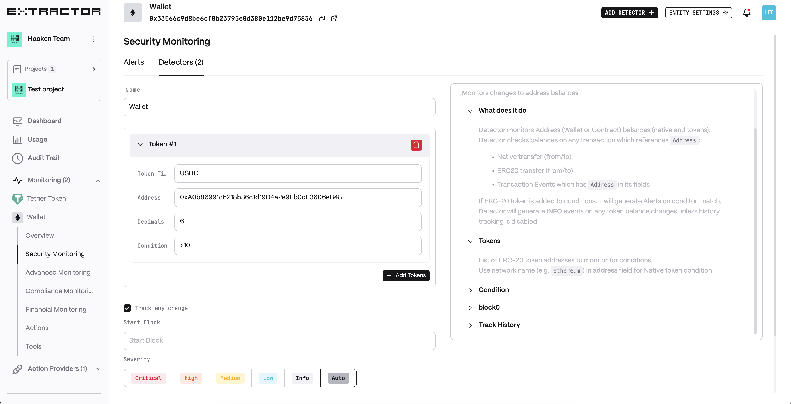
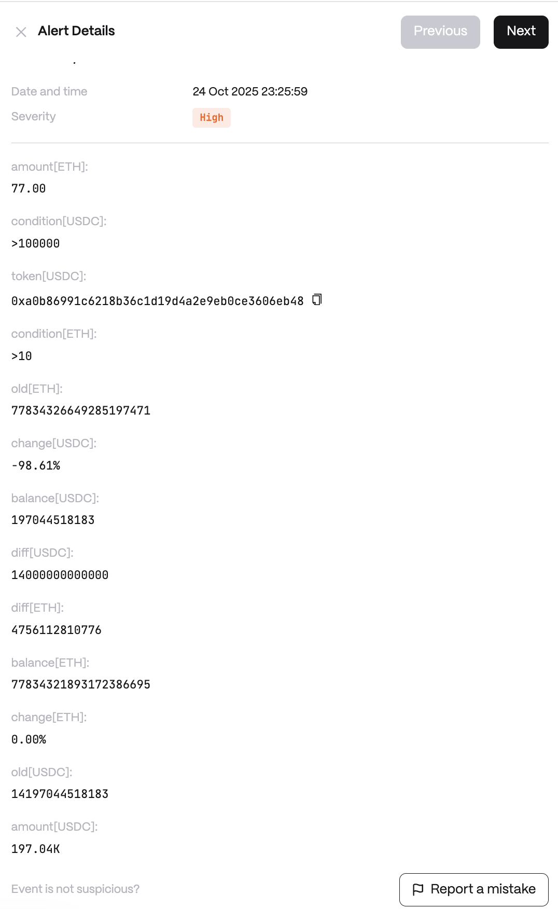

# Wallet

**Behavior**  
Detector monitors Address (Wallet or Contract) balances (native and tokens).

Detector checks balances on any transaction which references Address:

* Native transfer (from/to)
* ERC20 transfer (from/to)
* Transaction Events which has Address in its fields

If ERC-20 token is added to conditions, it will generate Alerts on conditon match.

Detector will generate *INFO* events on any token balance changes unless history tracking is disabled

**Use cases**  
* Hot Wallet Security: keeps track of the balance of these wallets across native coins and tokens. Notice an unexpected balance change – like a large outflow of ETH that wasn’t initiated by the system – monitor immediately alerts the security team. This rapid notification could indicate a potential compromise or unauthorized withdrawal, allowing to quickly freeze transactions and investigate, minimizing loss.

* Smart Contract Treasury Tracking: monitor to its key smart contract addresses, such as liquidity pools or treasury contracts. The detector will generate events for any significant balance shifts involving those contracts. For instance, if an exploit is draining funds from a liquidity pool (reflected as a rapid drop in the pool’s token balances), the monitor will catch the change. It can then alert the protocol administrators and even trigger automated safety measures (like pausing the contract or halting withdrawals) to prevent further damage.

**Detector Configuration**  
1. *Name* - Enter a descriptive name for your monitor, for example: "Wallet".
2. *Token*
3. *Track any change*
4. *Start block* - Leave empty to track from latest block.*This option is used only by Admins for replays and will have no effect for real-time on-chain streams.*
<figure><figcaption></figcaption></figure>

**Alert example**
<figure><figcaption></figcaption></figure>