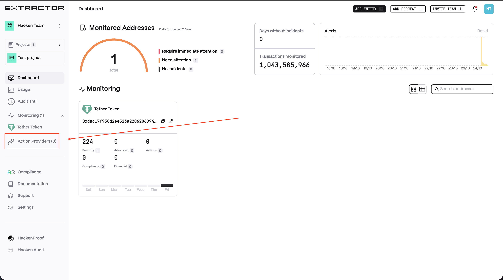
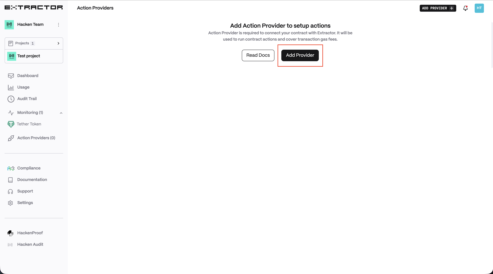
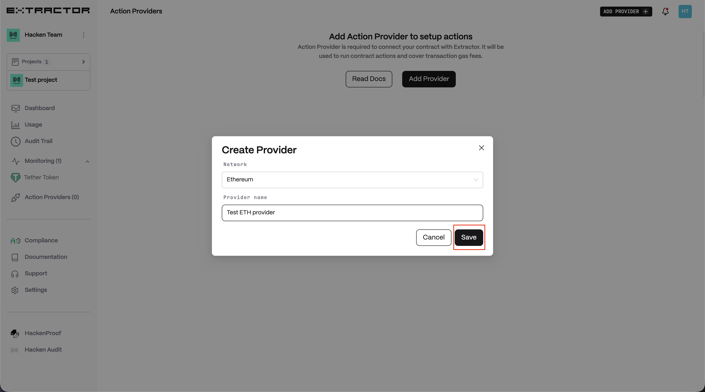
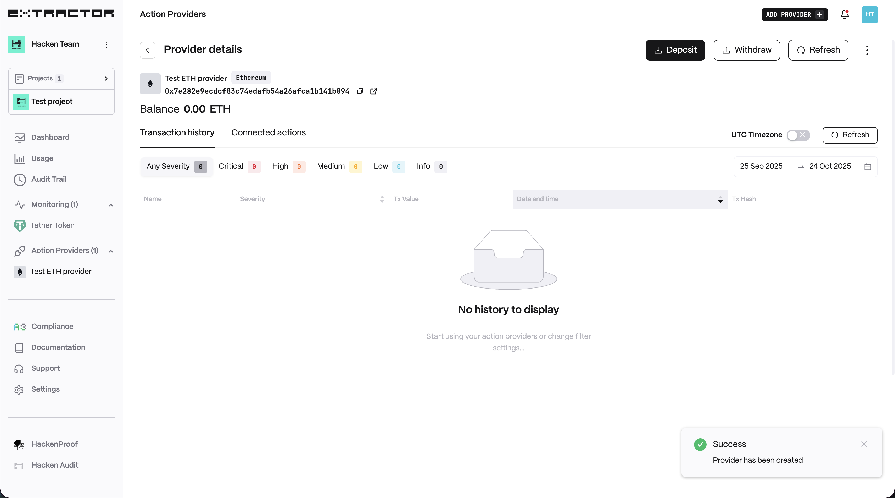

# Create Action Provider

To create the Action Provider you need to accomplish the following steps:

1. Open Action Providers
    <figure><figcaption></figcaption></figure>
2. Click on "Add provider"
    <figure><figcaption></figcaption></figure>
3. Choose the network, enter Provider name and click "Save"
    <figure><figcaption></figcaption></figure>
4. Action Provider created
    <figure><figcaption></figcaption></figure>

As a next step, you should connect it to the contract and transfer funds to Provider's address.
