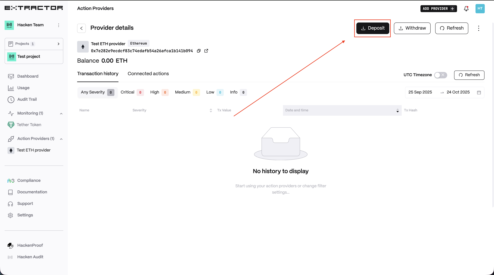
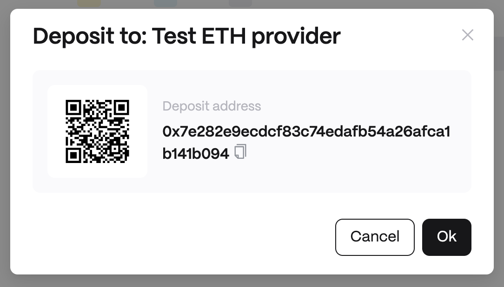

# Deposit

In order to execute a transaction that you configured as Smart Contract Action it should have sufficient balance to cover the transaction fee. To deposit action provider:

1. Open Action Providers
    <figure><figcaption></figcaption></figure>
2. Choose provider by clicking on it
    <figure><figcaption></figcaption></figure>
2. Click on the "Deposit" Button
    <figure><figcaption></figcaption></figure>
3. Scan QR or copy the deposit address to send funds.
    <figure><figcaption></figcaption></figure>
