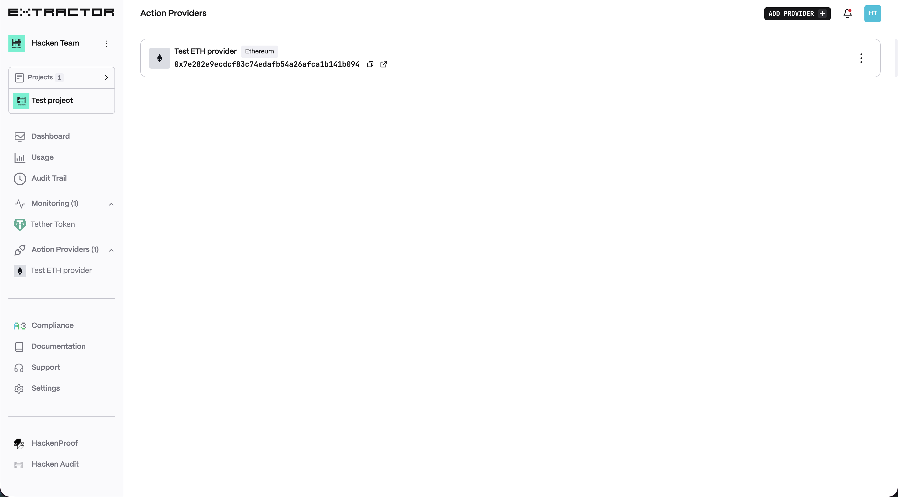
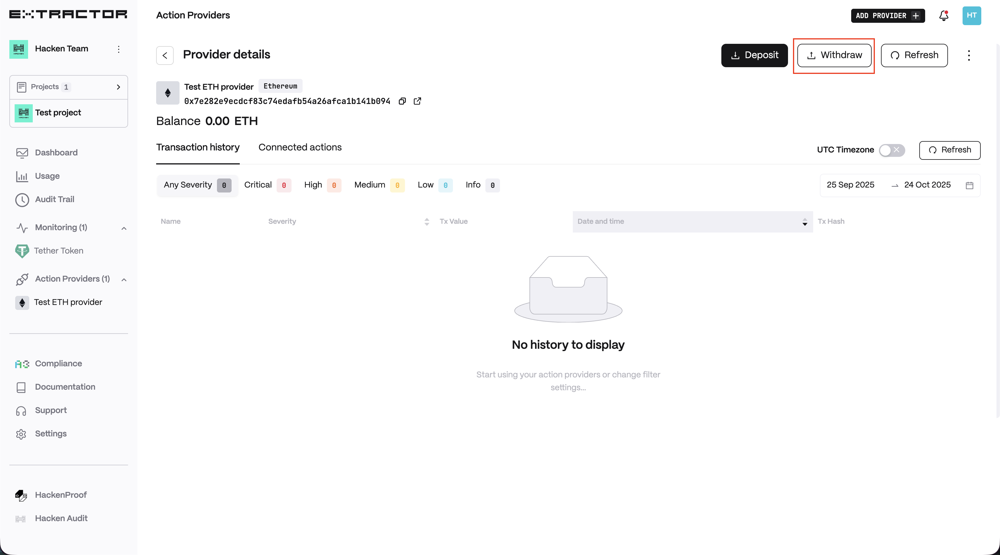
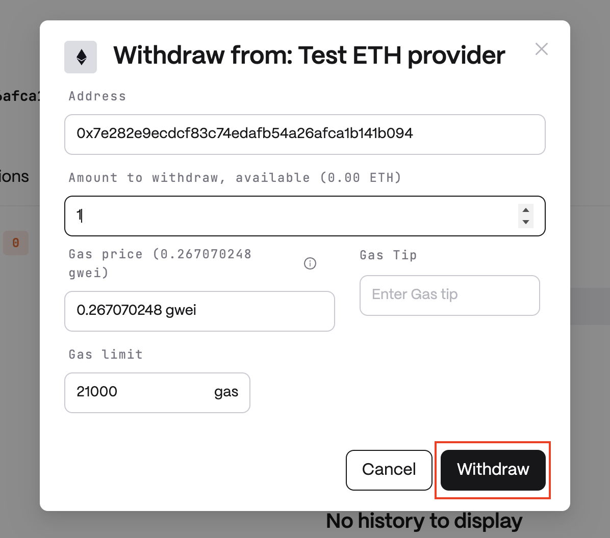

# Withdraw

If you don't use the Smart Contract action feature anymore, you're able to withdraw all your funds from it. To do that make the following steps:

1. Open Action Providers.
    <figure><figcaption></figcaption></figure>
2. Choose provider by clicking on it.
    <figure><figcaption></figcaption></figure>
3. Click on Withdraw button.
    <figure><figcaption></figcaption></figure>
4. Enter address, amount, gas tip(optionaly) and click on "Withdraw" button.
    <figure><figcaption></figcaption></figure>
