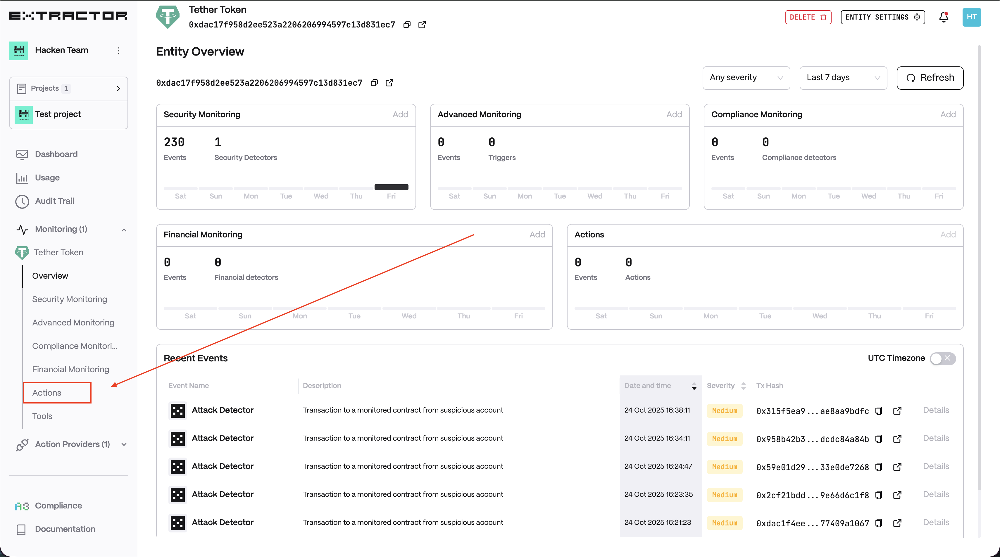
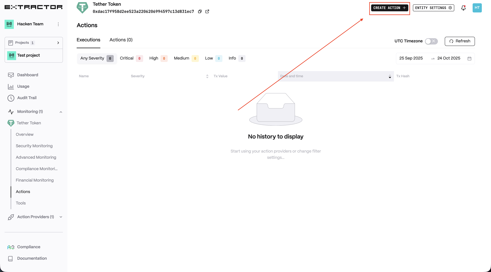
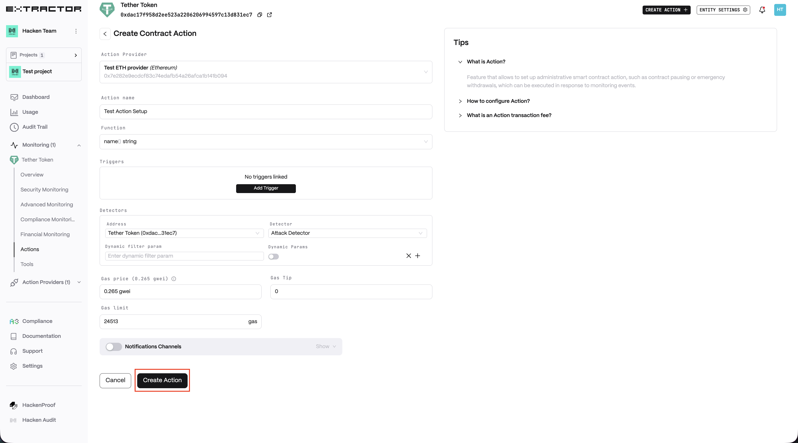
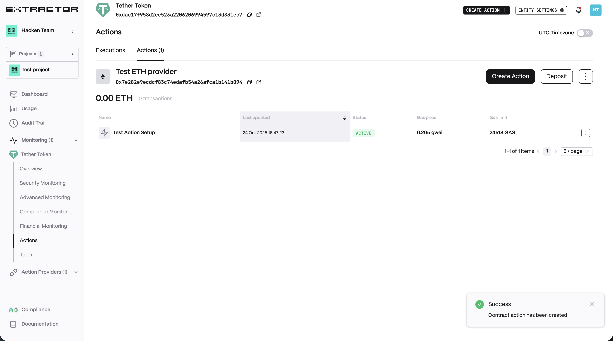
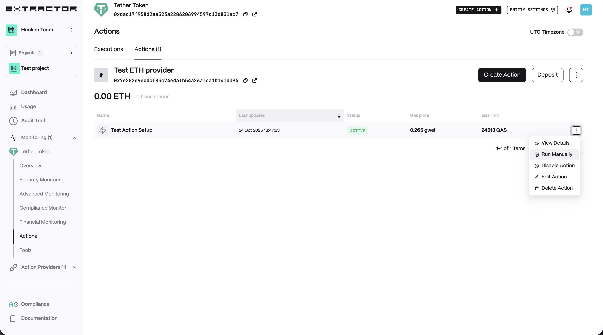
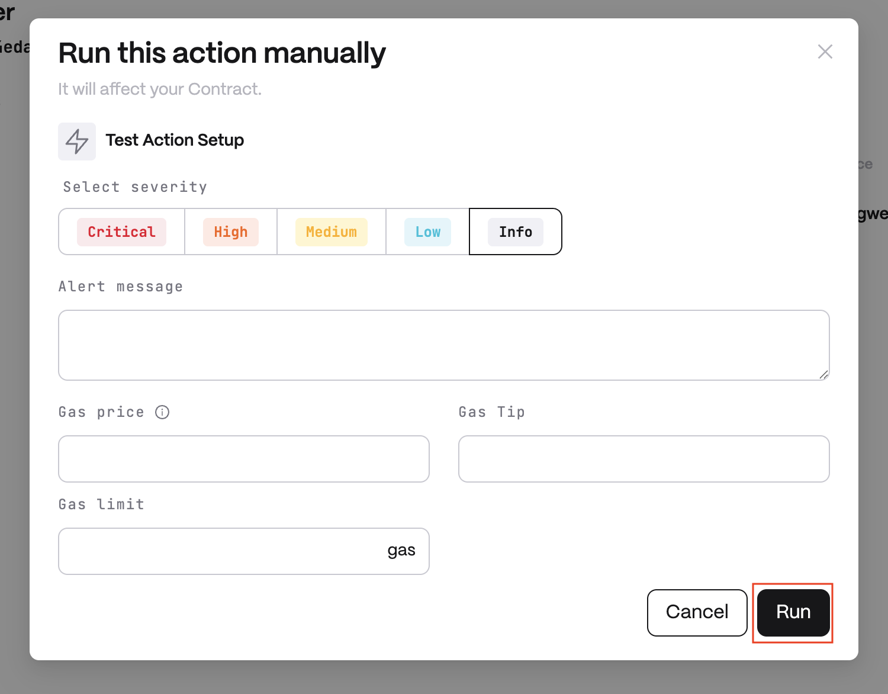

# Setup Action

To activate Smart Contract Action you need to complete the following steps:

1. [Create an action provider](action-providers/create-action-provider.md)
2. Open Actions page
    <figure><figcaption></figcaption></figure>
3. Click on "Create Action" button
    <figure><figcaption></figcaption></figure>
4. Action setup
    * Enter action name.
    * Choose function you want to execute.
    * Choose Trigger/Detector you want to run action.(optionaly, can be ran manually)
    * Enter gas(optionaly).
    * Click on "Create Action" button.
        <figure><figcaption></figcaption></figure>
5. Action created.
    <figure><figcaption></figcaption></figure>

Contract Action will be called automatically in response to a trigger and in case you have enough funds on the Action Provider balance to cover the transaction gas fee. You can also run action manually if you need.
1. Click on the action menu and select Run Manually.
    <figure><figcaption></figcaption></figure>
2. Action run
    * Choose severity(optionaly, info by default).
    * Enter alert message(optionaly, detector/trigger message by default).
    * Enter gas(optionaly, market values by default).
    * Click on "Run" button
    <figure><figcaption></figcaption></figure>
